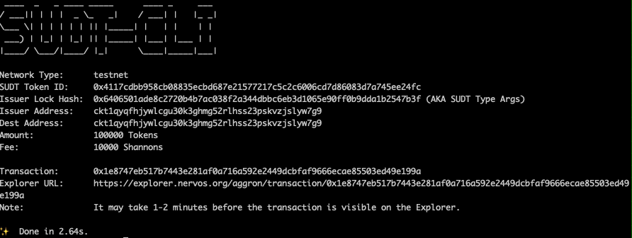
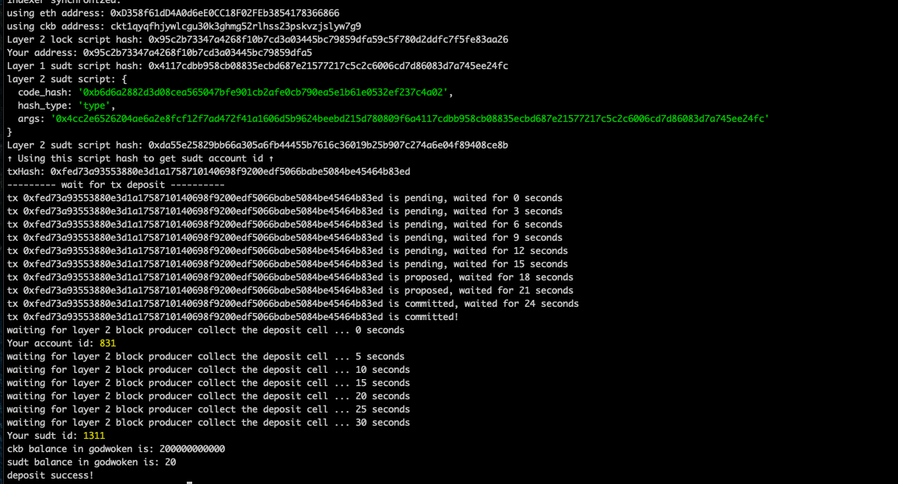

1. Layer1 address: ckt1qyqfhjywlcgu30k3ghmg52rlhss23pskvzjslyw7g9
2. sudt:

   

3. Txid: https://explorer.nervos.org/aggron/transaction/0x1e8747eb517b7443e281af0a716a592e2449dcbfaf9666ecae85503ed49e199a
4. Layer2 deposit

  

5. sudt id: 1311
