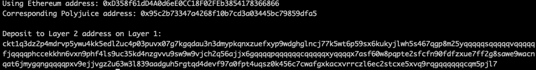

1. receiver address png: 
2. receiver address txt: ckt1q3dz2p4mdrvp5ywu4kk5edl2uc4p03puvx07g7kgqdau3n3dmypkqnxzuefxyp9wdghglncj77k5wt6p59sx6kukyjlwh5s467qgp8m25yqqqqqsqqqqqvqqqqqfjqqqqphccekkhn6vxn9phf4ls9uc35kd4nzgvvu9sw9w9vjch2q56ajjx6gqqqqpqqqqqqcqqqqqxyqqqqx7asf60w8pqpte2sfcfn90fdfzxue7ff2g8sawe9wacnqat6jmygqngqqqqpxv9ejjvgz2u63w3l839aadguh5rgtqd4devf97a0fpt4uqsz0k456c7cwafgxkacxvrrczl6ec2stcxe5xvq9rqgqqqqqqcqm5pjl7
3. 0xD358f61dD4A0d6eE0CC18F02FEb3854178366866
4. https://rinkeby.etherscan.io/tx/0x31e65e14a0d97102b1ae2c46bc15862bb6a6faec72ac5823977cf417f541493b
5. https://explorer.nervos.org/aggron/transaction/0xf0448c6e5bcb0d70ede3fe5e777e06c97179c2f87d9acb6f16d637fccc86ab55
