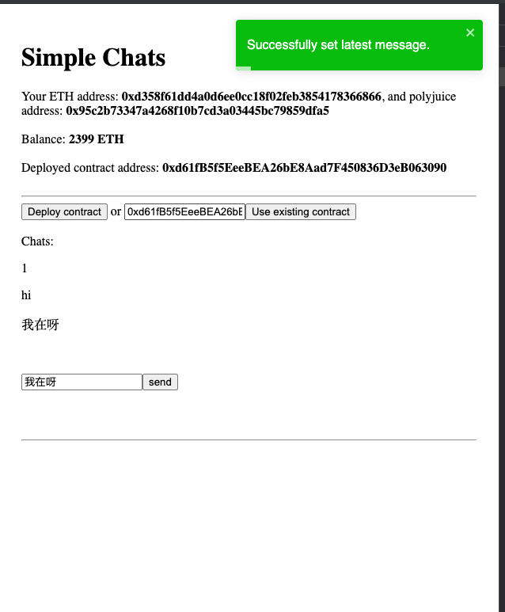

1. Web Screenshot:
    
2. [Example](https://github.com/hhuuaa/gitcoin_ckb/tree/main/task7/example)
3. Txid: 0x49b1b7785aa997745dabd5cf5727a2f8deb50fcd61addfad322925859acba0a7 , Contract: 0xd61fB5f5EeeBEA26bE8Aad7F450836D3eB063090 and ABI:
```
{
  "contractName": "SimpleChat",
  "abi": [
    {
      "inputs": [],
      "stateMutability": "nonpayable",
      "type": "constructor"
    },
    {
      "anonymous": false,
      "inputs": [
        {
          "indexed": true,
          "internalType": "address",
          "name": "talker",
          "type": "address"
        },
        {
          "indexed": false,
          "internalType": "string",
          "name": "message",
          "type": "string"
        }
      ],
      "name": "Message",
      "type": "event"
    },
    {
      "inputs": [
        {
          "internalType": "string",
          "name": "newMessage",
          "type": "string"
        }
      ],
      "name": "set",
      "outputs": [],
      "stateMutability": "nonpayable",
      "type": "function"
    },
    {
      "inputs": [],
      "name": "get",
      "outputs": [
        {
          "internalType": "string",
          "name": "",
          "type": "string"
        }
      ],
      "stateMutability": "view",
      "type": "function"
    }
  ],
  "metadata": "{\"compiler\":{\"version\":\"0.8.3+commit.8d00100c\"},\"language\":\"Solidity\",\"output\":{\"abi\":[{\"inputs\":[],\"stateMutability\":\"nonpayable\",\"type\":\"constructor\"},{\"anonymous\":false,\"inputs\":[{\"indexed\":true,\"internalType\":\"address\",\"name\":\"talker\",\"type\":\"address\"},{\"indexed\":false,\"internalType\":\"string\",\"name\":\"message\",\"type\":\"string\"}],\"name\":\"Message\",\"type\":\"event\"},{\"inputs\":[],\"name\":\"get\",\"outputs\":[{\"internalType\":\"string\",\"name\":\"\",\"type\":\"string\"}],\"stateMutability\":\"view\",\"type\":\"function\"},{\"inputs\":[{\"internalType\":\"string\",\"name\":\"newMessage\",\"type\":\"string\"}],\"name\":\"set\",\"outputs\":[],\"stateMutability\":\"nonpayable\",\"type\":\"function\"}],\"devdoc\":{\"kind\":\"dev\",\"methods\":{},\"version\":1},\"userdoc\":{\"kind\":\"user\",\"methods\":{},\"version\":1}},\"settings\":{\"compilationTarget\":{\"/Users/huazhou/gitcoin_ckb/blockchain-workshop-ethereum-simple/contracts/SimpleChat.sol\":\"SimpleChat\"},\"evmVersion\":\"istanbul\",\"libraries\":{},\"metadata\":{\"bytecodeHash\":\"ipfs\"},\"optimizer\":{\"enabled\":false,\"runs\":200},\"remappings\":[]},\"sources\":{\"/Users/huazhou/gitcoin_ckb/blockchain-workshop-ethereum-simple/contracts/SimpleChat.sol\":{\"keccak256\":\"0xfe0bd39b40fd8853b5837cb949632df398c454d9dc7b5d648543709136a3e949\",\"urls\":[\"bzz-raw://4f007b937171f691b829276047b786b2672b98ffa426a05cd3c3792445151edb\",\"dweb:/ipfs/QmVa1T1JJ7aU5Tf2CEGZXWmiQjo18bg4oSDBqQKK8LNkKH\"]}},\"version\":1}",
  "bytecode": "0x608060405234801561001057600080fd5b506040518060400160405280600b81526020017f48656c6c6f20776f726c640000000000000000000000000000000000000000008152506000908051906020019061005c929190610062565b50610166565b82805461006e90610105565b90600052602060002090601f01602090048101928261009057600085556100d7565b82601f106100a957805160ff19168380011785556100d7565b828001600101855582156100d7579182015b828111156100d65782518255916020019190600101906100bb565b5b5090506100e491906100e8565b5090565b5b808211156101015760008160009055506001016100e9565b5090565b6000600282049050600182168061011d57607f821691505b6020821081141561013157610130610137565b5b50919050565b7f4e487b7100000000000000000000000000000000000000000000000000000000600052602260045260246000fd5b61058a806101756000396000f3fe608060405234801561001057600080fd5b50600436106100365760003560e01c80634ed3885e1461003b5780636d4ce63c14610057575b600080fd5b6100556004803603810190610050919061027b565b610075565b005b61005f6100de565b60405161006c9190610375565b60405180910390f35b806000908051906020019061008b929190610170565b503373ffffffffffffffffffffffffffffffffffffffff167f811f7cff0a3374ff67cccc3726035d34ba70410e0256818a891e4d6acc01d88e60006040516100d39190610397565b60405180910390a250565b6060600080546100ed90610482565b80601f016020809104026020016040519081016040528092919081815260200182805461011990610482565b80156101665780601f1061013b57610100808354040283529160200191610166565b820191906000526020600020905b81548152906001019060200180831161014957829003601f168201915b5050505050905090565b82805461017c90610482565b90600052602060002090601f01602090048101928261019e57600085556101e5565b82601f106101b757805160ff19168380011785556101e5565b828001600101855582156101e5579182015b828111156101e45782518255916020019190600101906101c9565b5b5090506101f291906101f6565b5090565b5b8082111561020f5760008160009055506001016101f7565b5090565b6000610226610221846103de565b6103b9565b90508281526020810184848401111561023e57600080fd5b610249848285610440565b509392505050565b600082601f83011261026257600080fd5b8135610272848260208601610213565b91505092915050565b60006020828403121561028d57600080fd5b600082013567ffffffffffffffff8111156102a757600080fd5b6102b384828501610251565b91505092915050565b60006102c782610424565b6102d1818561042f565b93506102e181856020860161044f565b6102ea81610543565b840191505092915050565b6000815461030281610482565b61030c818661042f565b9450600182166000811461032757600181146103395761036c565b60ff198316865260208601935061036c565b6103428561040f565b60005b8381101561036457815481890152600182019150602081019050610345565b808801955050505b50505092915050565b6000602082019050818103600083015261038f81846102bc565b905092915050565b600060208201905081810360008301526103b181846102f5565b905092915050565b60006103c36103d4565b90506103cf82826104b4565b919050565b6000604051905090565b600067ffffffffffffffff8211156103f9576103f8610514565b5b61040282610543565b9050602081019050919050565b60008190508160005260206000209050919050565b600081519050919050565b600082825260208201905092915050565b82818337600083830152505050565b60005b8381101561046d578082015181840152602081019050610452565b8381111561047c576000848401525b50505050565b6000600282049050600182168061049a57607f821691505b602082108114156104ae576104ad6104e5565b5b50919050565b6104bd82610543565b810181811067ffffffffffffffff821117156104dc576104db610514565b5b80604052505050565b7f4e487b7100000000000000000000000000000000000000000000000000000000600052602260045260246000fd5b7f4e487b7100000000000000000000000000000000000000000000000000000000600052604160045260246000fd5b6000601f19601f830116905091905056fea2646970667358221220b7f8d1b1bf768198cf50a8abe9dc173758f0b673e9acb59f1131a19537ffc20964736f6c63430008030033",
  "deployedBytecode": "0x608060405234801561001057600080fd5b50600436106100365760003560e01c80634ed3885e1461003b5780636d4ce63c14610057575b600080fd5b6100556004803603810190610050919061027b565b610075565b005b61005f6100de565b60405161006c9190610375565b60405180910390f35b806000908051906020019061008b929190610170565b503373ffffffffffffffffffffffffffffffffffffffff167f811f7cff0a3374ff67cccc3726035d34ba70410e0256818a891e4d6acc01d88e60006040516100d39190610397565b60405180910390a250565b6060600080546100ed90610482565b80601f016020809104026020016040519081016040528092919081815260200182805461011990610482565b80156101665780601f1061013b57610100808354040283529160200191610166565b820191906000526020600020905b81548152906001019060200180831161014957829003601f168201915b5050505050905090565b82805461017c90610482565b90600052602060002090601f01602090048101928261019e57600085556101e5565b82601f106101b757805160ff19168380011785556101e5565b828001600101855582156101e5579182015b828111156101e45782518255916020019190600101906101c9565b5b5090506101f291906101f6565b5090565b5b8082111561020f5760008160009055506001016101f7565b5090565b6000610226610221846103de565b6103b9565b90508281526020810184848401111561023e57600080fd5b610249848285610440565b509392505050565b600082601f83011261026257600080fd5b8135610272848260208601610213565b91505092915050565b60006020828403121561028d57600080fd5b600082013567ffffffffffffffff8111156102a757600080fd5b6102b384828501610251565b91505092915050565b60006102c782610424565b6102d1818561042f565b93506102e181856020860161044f565b6102ea81610543565b840191505092915050565b6000815461030281610482565b61030c818661042f565b9450600182166000811461032757600181146103395761036c565b60ff198316865260208601935061036c565b6103428561040f565b60005b8381101561036457815481890152600182019150602081019050610345565b808801955050505b50505092915050565b6000602082019050818103600083015261038f81846102bc565b905092915050565b600060208201905081810360008301526103b181846102f5565b905092915050565b60006103c36103d4565b90506103cf82826104b4565b919050565b6000604051905090565b600067ffffffffffffffff8211156103f9576103f8610514565b5b61040282610543565b9050602081019050919050565b60008190508160005260206000209050919050565b600081519050919050565b600082825260208201905092915050565b82818337600083830152505050565b60005b8381101561046d578082015181840152602081019050610452565b8381111561047c576000848401525b50505050565b6000600282049050600182168061049a57607f821691505b602082108114156104ae576104ad6104e5565b5b50919050565b6104bd82610543565b810181811067ffffffffffffffff821117156104dc576104db610514565b5b80604052505050565b7f4e487b7100000000000000000000000000000000000000000000000000000000600052602260045260246000fd5b7f4e487b7100000000000000000000000000000000000000000000000000000000600052604160045260246000fd5b6000601f19601f830116905091905056fea2646970667358221220b7f8d1b1bf768198cf50a8abe9dc173758f0b673e9acb59f1131a19537ffc20964736f6c63430008030033",
  "immutableReferences": {},
  "generatedSources": [
    {
      "ast": {
        "nodeType": "YulBlock",
        "src": "0:516:1",
        "statements": [
          {
            "body": {
              "nodeType": "YulBlock",
              "src": "58:269:1",
              "statements": [
                {
                  "nodeType": "YulAssignment",
                  "src": "68:22:1",
                  "value": {
                    "arguments": [
                      {
                        "name": "data",
                        "nodeType": "YulIdentifier",
                        "src": "82:4:1"
                      },
                      {
                        "kind": "number",
                        "nodeType": "YulLiteral",
                        "src": "88:1:1",
                        "type": "",
                        "value": "2"
                      }
                    ],
                    "functionName": {
                      "name": "div",
                      "nodeType": "YulIdentifier",
                      "src": "78:3:1"
                    },
                    "nodeType": "YulFunctionCall",
                    "src": "78:12:1"
                  },
                  "variableNames": [
                    {
                      "name": "length",
                      "nodeType": "YulIdentifier",
                      "src": "68:6:1"
                    }
                  ]
                },
                {
                  "nodeType": "YulVariableDeclaration",
                  "src": "99:38:1",
                  "value": {
                    "arguments": [
                      {
                        "name": "data",
                        "nodeType": "YulIdentifier",
                        "src": "129:4:1"
                      },
                      {
                        "kind": "number",
                        "nodeType": "YulLiteral",
                        "src": "135:1:1",
                        "type": "",
                        "value": "1"
                      }
                    ],
                    "functionName": {
                      "name": "and",
                      "nodeType": "YulIdentifier",
                      "src": "125:3:1"
                    },
                    "nodeType": "YulFunctionCall",
                    "src": "125:12:1"
                  },
                  "variables": [
                    {
                      "name": "outOfPlaceEncoding",
                      "nodeType": "YulTypedName",
                      "src": "103:18:1",
                      "type": ""
                    }
                  ]
                },
                {
                  "body": {
                    "nodeType": "YulBlock",
                    "src": "176:51:1",
                    "statements": [
                      {
                        "nodeType": "YulAssignment",
                        "src": "190:27:1",
                        "value": {
                          "arguments": [
                            {
                              "name": "length",
                              "nodeType": "YulIdentifier",
                              "src": "204:6:1"
                            },
                            {
                              "kind": "number",
                              "nodeType": "YulLiteral",
                              "src": "212:4:1",
                              "type": "",
                              "value": "0x7f"
                            }
                          ],
                          "functionName": {
                            "name": "and",
                            "nodeType": "YulIdentifier",
                            "src": "200:3:1"
                          },
                          "nodeType": "YulFunctionCall",
                          "src": "200:17:1"
                        },
                        "variableNames": [
                          {
                            "name": "length",
                            "nodeType": "YulIdentifier",
                            "src": "190:6:1"
                          }
                        ]
                      }
                    ]
                  },
                  "condition": {
                    "arguments": [
                      {
                        "name": "outOfPlaceEncoding",
                        "nodeType": "YulIdentifier",
                        "src": "156:18:1"
                      }
                    ],
                    "functionName": {
                      "name": "iszero",
                      "nodeType": "YulIdentifier",
                      "src": "149:6:1"
                    },
                    "nodeType": "YulFunctionCall",
                    "src": "149:26:1"
                  },
                  "nodeType": "YulIf",
                  "src": "146:2:1"
                },
                {
                  "body": {
                    "nodeType": "YulBlock",
                    "src": "279:42:1",
                    "statements": [
                      {
                        "expression": {
                          "arguments": [],
                          "functionName": {
                            "name": "panic_error_0x22",
                            "nodeType": "YulIdentifier",
                            "src": "293:16:1"
                          },
                          "nodeType": "YulFunctionCall",
                          "src": "293:18:1"
                        },
                        "nodeType": "YulExpressionStatement",
                        "src": "293:18:1"
                      }
                    ]
                  },
                  "condition": {
                    "arguments": [
                      {
                        "name": "outOfPlaceEncoding",
                        "nodeType": "YulIdentifier",
                        "src": "243:18:1"
                      },
                      {
                        "arguments": [
                          {
                            "name": "length",
                            "nodeType": "YulIdentifier",
                            "src": "266:6:1"
                          },
                          {
                            "kind": "number",
                            "nodeType": "YulLiteral",
                            "src": "274:2:1",
                            "type": "",
                            "value": "32"
                          }
                        ],
                        "functionName": {
                          "name": "lt",
                          "nodeType": "YulIdentifier",
                          "src": "263:2:1"
                        },
                        "nodeType": "YulFunctionCall",
                        "src": "263:14:1"
                      }
                    ],
                    "functionName": {
                      "name": "eq",
                      "nodeType": "YulIdentifier",
                      "src": "240:2:1"
                    },
                    "nodeType": "YulFunctionCall",
                    "src": "240:38:1"
                  },
                  "nodeType": "YulIf",
                  "src": "237:2:1"
                }
              ]
            },
            "name": "extract_byte_array_length",
            "nodeType": "YulFunctionDefinition",
            "parameters": [
              {
                "name": "data",
                "nodeType": "YulTypedName",
                "src": "42:4:1",
                "type": ""
              }
            ],
            "returnVariables": [
              {
                "name": "length",
                "nodeType": "YulTypedName",
                "src": "51:6:1",
                "type": ""
              }
            ],
            "src": "7:320:1"
          },
          {
            "body": {
              "nodeType": "YulBlock",
              "src": "361:152:1",
              "statements": [
                {
                  "expression": {
                    "arguments": [
                      {
                        "kind": "number",
                        "nodeType": "YulLiteral",
                        "src": "378:1:1",
                        "type": "",
                        "value": "0"
                      },
                      {
                        "kind": "number",
                        "nodeType": "YulLiteral",
                        "src": "381:77:1",
                        "type": "",
                        "value": "35408467139433450592217433187231851964531694900788300625387963629091585785856"
                      }
                    ],
                    "functionName": {
                      "name": "mstore",
                      "nodeType": "YulIdentifier",
                      "src": "371:6:1"
                    },
                    "nodeType": "YulFunctionCall",
                    "src": "371:88:1"
                  },
                  "nodeType": "YulExpressionStatement",
                  "src": "371:88:1"
                },
                {
                  "expression": {
                    "arguments": [
                      {
                        "kind": "number",
                        "nodeType": "YulLiteral",
                        "src": "475:1:1",
                        "type": "",
                        "value": "4"
                      },
                      {
                        "kind": "number",
                        "nodeType": "YulLiteral",
                        "src": "478:4:1",
                        "type": "",
                        "value": "0x22"
                      }
                    ],
                    "functionName": {
                      "name": "mstore",
                      "nodeType": "YulIdentifier",
                      "src": "468:6:1"
                    },
                    "nodeType": "YulFunctionCall",
                    "src": "468:15:1"
                  },
                  "nodeType": "YulExpressionStatement",
                  "src": "468:15:1"
                },
                {
                  "expression": {
                    "arguments": [
                      {
                        "kind": "number",
                        "nodeType": "YulLiteral",
                        "src": "499:1:1",
                        "type": "",
                        "value": "0"
                      },
                      {
                        "kind": "number",
                        "nodeType": "YulLiteral",
                        "src": "502:4:1",
                        "type": "",
                        "value": "0x24"
                      }
                    ],
                    "functionName": {
                      "name": "revert",
                      "nodeType": "YulIdentifier",
                      "src": "492:6:1"
                    },
                    "nodeType": "YulFunctionCall",
                    "src": "492:15:1"
                  },
                  "nodeType": "YulExpressionStatement",
                  "src": "492:15:1"
                }
              ]
            },
            "name": "panic_error_0x22",
            "nodeType": "YulFunctionDefinition",
            "src": "333:180:1"
          }
        ]
      },
      "contents": "{\n\n    function extract_byte_array_length(data) -> length {\n        length := div(data, 2)\n        let outOfPlaceEncoding := and(data, 1)\n        if iszero(outOfPlaceEncoding) {\n            length := and(length, 0x7f)\n        }\n\n        if eq(outOfPlaceEncoding, lt(length, 32)) {\n            panic_error_0x22()\n        }\n    }\n\n    function panic_error_0x22() {\n        mstore(0, 35408467139433450592217433187231851964531694900788300625387963629091585785856)\n        mstore(4, 0x22)\n        revert(0, 0x24)\n    }\n\n}\n",
      "id": 1,
      "language": "Yul",
      "name": "#utility.yul"
    }
  ],
  "deployedGeneratedSources": [
    {
      "ast": {
        "nodeType": "YulBlock",
        "src": "0:5386:1",
        "statements": [
          {
            "body": {
              "nodeType": "YulBlock",
              "src": "91:261:1",
              "statements": [
                {
                  "nodeType": "YulAssignment",
                  "src": "101:75:1",
                  "value": {
                    "arguments": [
                      {
                        "arguments": [
                          {
                            "name": "length",
                            "nodeType": "YulIdentifier",
                            "src": "168:6:1"
                          }
                        ],
                        "functionName": {
                          "name": "array_allocation_size_t_string_memory_ptr",
                          "nodeType": "YulIdentifier",
                          "src": "126:41:1"
                        },
                        "nodeType": "YulFunctionCall",
                        "src": "126:49:1"
                      }
                    ],
                    "functionName": {
                      "name": "allocate_memory",
                      "nodeType": "YulIdentifier",
                      "src": "110:15:1"
                    },
                    "nodeType": "YulFunctionCall",
                    "src": "110:66:1"
                  },
                  "variableNames": [
                    {
                      "name": "array",
                      "nodeType": "YulIdentifier",
                      "src": "101:5:1"
                    }
                  ]
                },
                {
                  "expression": {
                    "arguments": [
                      {
                        "name": "array",
                        "nodeType": "YulIdentifier",
                        "src": "192:5:1"
                      },
                      {
                        "name": "length",
                        "nodeType": "YulIdentifier",
                        "src": "199:6:1"
                      }
                    ],
                    "functionName": {
                      "name": "mstore",
                      "nodeType": "YulIdentifier",
                      "src": "185:6:1"
                    },
                    "nodeType": "YulFunctionCall",
                    "src": "185:21:1"
                  },
                  "nodeType": "YulExpressionStatement",
                  "src": "185:21:1"
                },
                {
                  "nodeType": "YulVariableDeclaration",
                  "src": "215:27:1",
                  "value": {
                    "arguments": [
                      {
                        "name": "array",
                        "nodeType": "YulIdentifier",
                        "src": "230:5:1"
                      },
                      {
                        "kind": "number",
                        "nodeType": "YulLiteral",
                        "src": "237:4:1",
                        "type": "",
                        "value": "0x20"
                      }
                    ],
                    "functionName": {
                      "name": "add",
                      "nodeType": "YulIdentifier",
                      "src": "226:3:1"
                    },
                    "nodeType": "YulFunctionCall",
                    "src": "226:16:1"
                  },
                  "variables": [
                    {
                      "name": "dst",
                      "nodeType": "YulTypedName",
                      "src": "219:3:1",
                      "type": ""
                    }
                  ]
                },
                {
                  "body": {
                    "nodeType": "YulBlock",
                    "src": "280:16:1",
                    "statements": [
                      {
                        "expression": {
                          "arguments": [
                            {
                              "kind": "number",
                              "nodeType": "YulLiteral",
                              "src": "289:1:1",
                              "type": "",
                              "value": "0"
                            },
                            {
                              "kind": "number",
                              "nodeType": "YulLiteral",
                              "src": "292:1:1",
                              "type": "",
                              "value": "0"
                            }
                          ],
                          "functionName": {
                            "name": "revert",
                            "nodeType": "YulIdentifier",
                            "src": "282:6:1"
                          },
                          "nodeType": "YulFunctionCall",
                          "src": "282:12:1"
                        },
                        "nodeType": "YulExpressionStatement",
                        "src": "282:12:1"
                      }
                    ]
                  },
                  "condition": {
                    "arguments": [
                      {
                        "arguments": [
                          {
                            "name": "src",
                            "nodeType": "YulIdentifier",
                            "src": "261:3:1"
                          },
                          {
                            "name": "length",
                            "nodeType": "YulIdentifier",
                            "src": "266:6:1"
                          }
                        ],
                        "functionName": {
                          "name": "add",
                          "nodeType": "YulIdentifier",
                          "src": "257:3:1"
                        },
                        "nodeType": "YulFunctionCall",
                        "src": "257:16:1"
                      },
                      {
                        "name": "end",
                        "nodeType": "YulIdentifier",
                        "src": "275:3:1"
                      }
                    ],
                    "functionName": {
                      "name": "gt",
                      "nodeType": "YulIdentifier",
                      "src": "254:2:1"
                    },
                    "nodeType": "YulFunctionCall",
                    "src": "254:25:1"
                  },
                  "nodeType": "YulIf",
                  "src": "251:2:1"
                },
                {
                  "expression": {
                    "arguments": [
                      {
                        "name": "src",
                        "nodeType": "YulIdentifier",
                        "src": "329:3:1"
                      },
                      {
                        "name": "dst",
                        "nodeType": "YulIdentifier",
                        "src": "334:3:1"
                      },
                      {
                        "name": "length",
                        "nodeType": "YulIdentifier",
                        "src": "339:6:1"
                      }
                    ],
                    "functionName": {
                      "name": "copy_calldata_to_memory",
                      "nodeType": "YulIdentifier",
                      "src": "305:23:1"
                    },
                    "nodeType": "YulFunctionCall",
                    "src": "305:41:1"
                  },
                  "nodeType": "YulExpressionStatement",
                  "src": "305:41:1"
                }
              ]
            },
            "name": "abi_decode_available_length_t_string_memory_ptr",
            "nodeType": "YulFunctionDefinition",
            "parameters": [
              {
                "name": "src",
                "nodeType": "YulTypedName",
                "src": "64:3:1",
                "type": ""
              },
              {
                "name": "length",
                "nodeType": "YulTypedName",
                "src": "69:6:1",
                "type": ""
              },
              {
                "name": "end",
                "nodeType": "YulTypedName",
                "src": "77:3:1",
                "type": ""
              }
            ],
            "returnVariables": [
              {
                "name": "array",
                "nodeType": "YulTypedName",
                "src": "85:5:1",
                "type": ""
              }
            ],
            "src": "7:345:1"
          },
          {
            "body": {
              "nodeType": "YulBlock",
              "src": "434:211:1",
              "statements": [
                {
                  "body": {
                    "nodeType": "YulBlock",
                    "src": "483:16:1",
                    "statements": [
                      {
                        "expression": {
                          "arguments": [
                            {
                              "kind": "number",
                              "nodeType": "YulLiteral",
                              "src": "492:1:1",
                              "type": "",
                              "value": "0"
                            },
                            {
                              "kind": "number",
                              "nodeType": "YulLiteral",
                              "src": "495:1:1",
                              "type": "",
                              "value": "0"
                            }
                          ],
                          "functionName": {
                            "name": "revert",
                            "nodeType": "YulIdentifier",
                            "src": "485:6:1"
                          },
                          "nodeType": "YulFunctionCall",
                          "src": "485:12:1"
                        },
                        "nodeType": "YulExpressionStatement",
                        "src": "485:12:1"
                      }
                    ]
                  },
                  "condition": {
                    "arguments": [
                      {
                        "arguments": [
                          {
                            "arguments": [
                              {
                                "name": "offset",
                                "nodeType": "YulIdentifier",
                                "src": "462:6:1"
                              },
                              {
                                "kind": "number",
                                "nodeType": "YulLiteral",
                                "src": "470:4:1",
                                "type": "",
                                "value": "0x1f"
                              }
                            ],
                            "functionName": {
                              "name": "add",
                              "nodeType": "YulIdentifier",
                              "src": "458:3:1"
                            },
                            "nodeType": "YulFunctionCall",
                            "src": "458:17:1"
                          },
                          {
                            "name": "end",
                            "nodeType": "YulIdentifier",
                            "src": "477:3:1"
                          }
                        ],
                        "functionName": {
                          "name": "slt",
                          "nodeType": "YulIdentifier",
                          "src": "454:3:1"
                        },
                        "nodeType": "YulFunctionCall",
                        "src": "454:27:1"
                      }
                    ],
                    "functionName": {
                      "name": "iszero",
                      "nodeType": "YulIdentifier",
                      "src": "447:6:1"
                    },
                    "nodeType": "YulFunctionCall",
                    "src": "447:35:1"
                  },
                  "nodeType": "YulIf",
                  "src": "444:2:1"
                },
                {
                  "nodeType": "YulVariableDeclaration",
                  "src": "508:34:1",
                  "value": {
                    "arguments": [
                      {
                        "name": "offset",
                        "nodeType": "YulIdentifier",
                        "src": "535:6:1"
                      }
                    ],
                    "functionName": {
                      "name": "calldataload",
                      "nodeType": "YulIdentifier",
                      "src": "522:12:1"
                    },
                    "nodeType": "YulFunctionCall",
                    "src": "522:20:1"
                  },
                  "variables": [
                    {
                      "name": "length",
                      "nodeType": "YulTypedName",
                      "src": "512:6:1",
                      "type": ""
                    }
                  ]
                },
                {
                  "nodeType": "YulAssignment",
                  "src": "551:88:1",
                  "value": {
                    "arguments": [
                      {
                        "arguments": [
                          {
                            "name": "offset",
                            "nodeType": "YulIdentifier",
                            "src": "612:6:1"
                          },
                          {
                            "kind": "number",
                            "nodeType": "YulLiteral",
                            "src": "620:4:1",
                            "type": "",
                            "value": "0x20"
                          }
                        ],
                        "functionName": {
                          "name": "add",
                          "nodeType": "YulIdentifier",
                          "src": "608:3:1"
                        },
                        "nodeType": "YulFunctionCall",
                        "src": "608:17:1"
                      },
                      {
                        "name": "length",
                        "nodeType": "YulIdentifier",
                        "src": "627:6:1"
                      },
                      {
                        "name": "end",
                        "nodeType": "YulIdentifier",
                        "src": "635:3:1"
                      }
                    ],
                    "functionName": {
                      "name": "abi_decode_available_length_t_string_memory_ptr",
                      "nodeType": "YulIdentifier",
                      "src": "560:47:1"
                    },
                    "nodeType": "YulFunctionCall",
                    "src": "560:79:1"
                  },
                  "variableNames": [
                    {
                      "name": "array",
                      "nodeType": "YulIdentifier",
                      "src": "551:5:1"
                    }
                  ]
                }
              ]
            },
            "name": "abi_decode_t_string_memory_ptr",
            "nodeType": "YulFunctionDefinition",
            "parameters": [
              {
                "name": "offset",
                "nodeType": "YulTypedName",
                "src": "412:6:1",
                "type": ""
              },
              {
                "name": "end",
                "nodeType": "YulTypedName",
                "src": "420:3:1",
                "type": ""
              }
            ],
            "returnVariables": [
              {
                "name": "array",
                "nodeType": "YulTypedName",
                "src": "428:5:1",
                "type": ""
              }
            ],
            "src": "372:273:1"
          },
          {
            "body": {
              "nodeType": "YulBlock",
              "src": "727:299:1",
              "statements": [
                {
                  "body": {
                    "nodeType": "YulBlock",
                    "src": "773:16:1",
                    "statements": [
                      {
                        "expression": {
                          "arguments": [
                            {
                              "kind": "number",
                              "nodeType": "YulLiteral",
                              "src": "782:1:1",
                              "type": "",
                              "value": "0"
                            },
                            {
                              "kind": "number",
                              "nodeType": "YulLiteral",
                              "src": "785:1:1",
                              "type": "",
                              "value": "0"
                            }
                          ],
                          "functionName": {
                            "name": "revert",
                            "nodeType": "YulIdentifier",
                            "src": "775:6:1"
                          },
                          "nodeType": "YulFunctionCall",
                          "src": "775:12:1"
                        },
                        "nodeType": "YulExpressionStatement",
                        "src": "775:12:1"
                      }
                    ]
                  },
                  "condition": {
                    "arguments": [
                      {
                        "arguments": [
                          {
                            "name": "dataEnd",
                            "nodeType": "YulIdentifier",
                            "src": "748:7:1"
                          },
                          {
                            "name": "headStart",
                            "nodeType": "YulIdentifier",
                            "src": "757:9:1"
                          }
                        ],
                        "functionName": {
                          "name": "sub",
                          "nodeType": "YulIdentifier",
                          "src": "744:3:1"
                        },
                        "nodeType": "YulFunctionCall",
                        "src": "744:23:1"
                      },
                      {
                        "kind": "number",
                        "nodeType": "YulLiteral",
                        "src": "769:2:1",
                        "type": "",
                        "value": "32"
                      }
                    ],
                    "functionName": {
                      "name": "slt",
                      "nodeType": "YulIdentifier",
                      "src": "740:3:1"
                    },
                    "nodeType": "YulFunctionCall",
                    "src": "740:32:1"
                  },
                  "nodeType": "YulIf",
                  "src": "737:2:1"
                },
                {
                  "nodeType": "YulBlock",
                  "src": "799:220:1",
                  "statements": [
                    {
                      "nodeType": "YulVariableDeclaration",
                      "src": "814:45:1",
                      "value": {
                        "arguments": [
                          {
                            "arguments": [
                              {
                                "name": "headStart",
                                "nodeType": "YulIdentifier",
                                "src": "845:9:1"
                              },
                              {
                                "kind": "number",
                                "nodeType": "YulLiteral",
                                "src": "856:1:1",
                                "type": "",
                                "value": "0"
                              }
                            ],
                            "functionName": {
                              "name": "add",
                              "nodeType": "YulIdentifier",
                              "src": "841:3:1"
                            },
                            "nodeType": "YulFunctionCall",
                            "src": "841:17:1"
                          }
                        ],
                        "functionName": {
                          "name": "calldataload",
                          "nodeType": "YulIdentifier",
                          "src": "828:12:1"
                        },
                        "nodeType": "YulFunctionCall",
                        "src": "828:31:1"
                      },
                      "variables": [
                        {
                          "name": "offset",
                          "nodeType": "YulTypedName",
                          "src": "818:6:1",
                          "type": ""
                        }
                      ]
                    },
                    {
                      "body": {
                        "nodeType": "YulBlock",
                        "src": "906:16:1",
                        "statements": [
                          {
                            "expression": {
                              "arguments": [
                                {
                                  "kind": "number",
                                  "nodeType": "YulLiteral",
                                  "src": "915:1:1",
                                  "type": "",
                                  "value": "0"
                                },
                                {
                                  "kind": "number",
                                  "nodeType": "YulLiteral",
                                  "src": "918:1:1",
                                  "type": "",
                                  "value": "0"
                                }
                              ],
                              "functionName": {
                                "name": "revert",
                                "nodeType": "YulIdentifier",
                                "src": "908:6:1"
                              },
                              "nodeType": "YulFunctionCall",
                              "src": "908:12:1"
                            },
                            "nodeType": "YulExpressionStatement",
                            "src": "908:12:1"
                          }
                        ]
                      },
                      "condition": {
                        "arguments": [
                          {
                            "name": "offset",
                            "nodeType": "YulIdentifier",
                            "src": "878:6:1"
                          },
                          {
                            "kind": "number",
                            "nodeType": "YulLiteral",
                            "src": "886:18:1",
                            "type": "",
                            "value": "0xffffffffffffffff"
                          }
                        ],
                        "functionName": {
                          "name": "gt",
                          "nodeType": "YulIdentifier",
                          "src": "875:2:1"
                        },
                        "nodeType": "YulFunctionCall",
                        "src": "875:30:1"
                      },
                      "nodeType": "YulIf",
                      "src": "872:2:1"
                    },
                    {
                      "nodeType": "YulAssignment",
                      "src": "936:73:1",
                      "value": {
                        "arguments": [
                          {
                            "arguments": [
                              {
                                "name": "headStart",
                                "nodeType": "YulIdentifier",
                                "src": "981:9:1"
                              },
                              {
                                "name": "offset",
                                "nodeType": "YulIdentifier",
                                "src": "992:6:1"
                              }
                            ],
                            "functionName": {
                              "name": "add",
                              "nodeType": "YulIdentifier",
                              "src": "977:3:1"
                            },
                            "nodeType": "YulFunctionCall",
                            "src": "977:22:1"
                          },
                          {
                            "name": "dataEnd",
                            "nodeType": "YulIdentifier",
                            "src": "1001:7:1"
                          }
                        ],
                        "functionName": {
                          "name": "abi_decode_t_string_memory_ptr",
                          "nodeType": "YulIdentifier",
                          "src": "946:30:1"
                        },
                        "nodeType": "YulFunctionCall",
                        "src": "946:63:1"
                      },
                      "variableNames": [
                        {
                          "name": "value0",
                          "nodeType": "YulIdentifier",
                          "src": "936:6:1"
                        }
                      ]
                    }
                  ]
                }
              ]
            },
            "name": "abi_decode_tuple_t_string_memory_ptr",
            "nodeType": "YulFunctionDefinition",
            "parameters": [
              {
                "name": "headStart",
                "nodeType": "YulTypedName",
                "src": "697:9:1",
                "type": ""
              },
              {
                "name": "dataEnd",
                "nodeType": "YulTypedName",
                "src": "708:7:1",
                "type": ""
              }
            ],
            "returnVariables": [
              {
                "name": "value0",
                "nodeType": "YulTypedName",
                "src": "720:6:1",
                "type": ""
              }
            ],
            "src": "651:375:1"
          },
          {
            "body": {
              "nodeType": "YulBlock",
              "src": "1124:272:1",
              "statements": [
                {
                  "nodeType": "YulVariableDeclaration",
                  "src": "1134:53:1",
                  "value": {
                    "arguments": [
                      {
                        "name": "value",
                        "nodeType": "YulIdentifier",
                        "src": "1181:5:1"
                      }
                    ],
                    "functionName": {
                      "name": "array_length_t_string_memory_ptr",
                      "nodeType": "YulIdentifier",
                      "src": "1148:32:1"
                    },
                    "nodeType": "YulFunctionCall",
                    "src": "1148:39:1"
                  },
                  "variables": [
                    {
                      "name": "length",
                      "nodeType": "YulTypedName",
                      "src": "1138:6:1",
                      "type": ""
                    }
                  ]
                },
                {
                  "nodeType": "YulAssignment",
                  "src": "1196:78:1",
                  "value": {
                    "arguments": [
                      {
                        "name": "pos",
                        "nodeType": "YulIdentifier",
                        "src": "1262:3:1"
                      },
                      {
                        "name": "length",
                        "nodeType": "YulIdentifier",
                        "src": "1267:6:1"
                      }
                    ],
                    "functionName": {
                      "name": "array_storeLengthForEncoding_t_string_memory_ptr_fromStack",
                      "nodeType": "YulIdentifier",
                      "src": "1203:58:1"
                    },
                    "nodeType": "YulFunctionCall",
                    "src": "1203:71:1"
                  },
                  "variableNames": [
                    {
                      "name": "pos",
                      "nodeType": "YulIdentifier",
                      "src": "1196:3:1"
                    }
                  ]
                },
                {
                  "expression": {
                    "arguments": [
                      {
                        "arguments": [
                          {
                            "name": "value",
                            "nodeType": "YulIdentifier",
                            "src": "1309:5:1"
                          },
                          {
                            "kind": "number",
                            "nodeType": "YulLiteral",
                            "src": "1316:4:1",
                            "type": "",
                            "value": "0x20"
                          }
                        ],
                        "functionName": {
                          "name": "add",
                          "nodeType": "YulIdentifier",
                          "src": "1305:3:1"
                        },
                        "nodeType": "YulFunctionCall",
                        "src": "1305:16:1"
                      },
                      {
                        "name": "pos",
                        "nodeType": "YulIdentifier",
                        "src": "1323:3:1"
                      },
                      {
                        "name": "length",
                        "nodeType": "YulIdentifier",
                        "src": "1328:6:1"
                      }
                    ],
                    "functionName": {
                      "name": "copy_memory_to_memory",
                      "nodeType": "YulIdentifier",
                      "src": "1283:21:1"
                    },
                    "nodeType": "YulFunctionCall",
                    "src": "1283:52:1"
                  },
                  "nodeType": "YulExpressionStatement",
                  "src": "1283:52:1"
                },
                {
                  "nodeType": "YulAssignment",
                  "src": "1344:46:1",
                  "value": {
                    "arguments": [
                      {
                        "name": "pos",
                        "nodeType": "YulIdentifier",
                        "src": "1355:3:1"
                      },
                      {
                        "arguments": [
                          {
                            "name": "length",
                            "nodeType": "YulIdentifier",
                            "src": "1382:6:1"
                          }
                        ],
                        "functionName": {
                          "name": "round_up_to_mul_of_32",
                          "nodeType": "YulIdentifier",
                          "src": "1360:21:1"
                        },
                        "nodeType": "YulFunctionCall",
                        "src": "1360:29:1"
                      }
                    ],
                    "functionName": {
                      "name": "add",
                      "nodeType": "YulIdentifier",
                      "src": "1351:3:1"
                    },
                    "nodeType": "YulFunctionCall",
                    "src": "1351:39:1"
                  },
                  "variableNames": [
                    {
                      "name": "end",
                      "nodeType": "YulIdentifier",
                      "src": "1344:3:1"
                    }
                  ]
                }
              ]
            },
            "name": "abi_encode_t_string_memory_ptr_to_t_string_memory_ptr_fromStack",
            "nodeType": "YulFunctionDefinition",
            "parameters": [
              {
                "name": "value",
                "nodeType": "YulTypedName",
                "src": "1105:5:1",
                "type": ""
              },
              {
                "name": "pos",
                "nodeType": "YulTypedName",
                "src": "1112:3:1",
                "type": ""
              }
            ],
            "returnVariables": [
              {
                "name": "end",
                "nodeType": "YulTypedName",
                "src": "1120:3:1",
                "type": ""
              }
            ],
            "src": "1032:364:1"
          },
          {
            "body": {
              "nodeType": "YulBlock",
              "src": "1515:713:1",
              "statements": [
                {
                  "nodeType": "YulVariableDeclaration",
                  "src": "1525:29:1",
                  "value": {
                    "arguments": [
                      {
                        "name": "value",
                        "nodeType": "YulIdentifier",
                        "src": "1548:5:1"
                      }
                    ],
                    "functionName": {
                      "name": "sload",
                      "nodeType": "YulIdentifier",
                      "src": "1542:5:1"
                    },
                    "nodeType": "YulFunctionCall",
                    "src": "1542:12:1"
                  },
                  "variables": [
                    {
                      "name": "slotValue",
                      "nodeType": "YulTypedName",
                      "src": "1529:9:1",
                      "type": ""
                    }
                  ]
                },
                {
                  "nodeType": "YulVariableDeclaration",
                  "src": "1563:50:1",
                  "value": {
                    "arguments": [
                      {
                        "name": "slotValue",
                        "nodeType": "YulIdentifier",
                        "src": "1603:9:1"
                      }
                    ],
                    "functionName": {
                      "name": "extract_byte_array_length",
                      "nodeType": "YulIdentifier",
                      "src": "1577:25:1"
                    },
                    "nodeType": "YulFunctionCall",
                    "src": "1577:36:1"
                  },
                  "variables": [
                    {
                      "name": "length",
                      "nodeType": "YulTypedName",
                      "src": "1567:6:1",
                      "type": ""
                    }
                  ]
                },
                {
                  "nodeType": "YulAssignment",
                  "src": "1622:78:1",
                  "value": {
                    "arguments": [
                      {
                        "name": "pos",
                        "nodeType": "YulIdentifier",
                        "src": "1688:3:1"
                      },
                      {
                        "name": "length",
                        "nodeType": "YulIdentifier",
                        "src": "1693:6:1"
                      }
                    ],
                    "functionName": {
                      "name": "array_storeLengthForEncoding_t_string_memory_ptr_fromStack",
                      "nodeType": "YulIdentifier",
                      "src": "1629:58:1"
                    },
                    "nodeType": "YulFunctionCall",
                    "src": "1629:71:1"
                  },
                  "variableNames": [
                    {
                      "name": "pos",
                      "nodeType": "YulIdentifier",
                      "src": "1622:3:1"
                    }
                  ]
                },
                {
                  "cases": [
                    {
                      "body": {
                        "nodeType": "YulBlock",
                        "src": "1749:128:1",
                        "statements": [
                          {
                            "expression": {
                              "arguments": [
                                {
                                  "name": "pos",
                                  "nodeType": "YulIdentifier",
                                  "src": "1802:3:1"
                                },
                                {
                                  "arguments": [
                                    {
                                      "name": "slotValue",
                                      "nodeType": "YulIdentifier",
                                      "src": "1811:9:1"
                                    },
                                    {
                                      "arguments": [
                                        {
                                          "kind": "number",
                                          "nodeType": "YulLiteral",
                                          "src": "1826:4:1",
                                          "type": "",
                                          "value": "0xff"
                                        }
                                      ],
                                      "functionName": {
                                        "name": "not",
                                        "nodeType": "YulIdentifier",
                                        "src": "1822:3:1"
                                      },
                                      "nodeType": "YulFunctionCall",
                                      "src": "1822:9:1"
                                    }
                                  ],
                                  "functionName": {
                                    "name": "and",
                                    "nodeType": "YulIdentifier",
                                    "src": "1807:3:1"
                                  },
                                  "nodeType": "YulFunctionCall",
                                  "src": "1807:25:1"
                                }
                              ],
                              "functionName": {
                                "name": "mstore",
                                "nodeType": "YulIdentifier",
                                "src": "1795:6:1"
                              },
                              "nodeType": "YulFunctionCall",
                              "src": "1795:38:1"
                            },
                            "nodeType": "YulExpressionStatement",
                            "src": "1795:38:1"
                          },
                          {
                            "nodeType": "YulAssignment",
                            "src": "1846:21:1",
                            "value": {
                              "arguments": [
                                {
                                  "name": "pos",
                                  "nodeType": "YulIdentifier",
                                  "src": "1857:3:1"
                                },
                                {
                                  "kind": "number",
                                  "nodeType": "YulLiteral",
                                  "src": "1862:4:1",
                                  "type": "",
                                  "value": "0x20"
                                }
                              ],
                              "functionName": {
                                "name": "add",
                                "nodeType": "YulIdentifier",
                                "src": "1853:3:1"
                              },
                              "nodeType": "YulFunctionCall",
                              "src": "1853:14:1"
                            },
                            "variableNames": [
                              {
                                "name": "ret",
                                "nodeType": "YulIdentifier",
                                "src": "1846:3:1"
                              }
                            ]
                          }
                        ]
                      },
                      "nodeType": "YulCase",
                      "src": "1742:135:1",
                      "value": {
                        "kind": "number",
                        "nodeType": "YulLiteral",
                        "src": "1747:1:1",
                        "type": "",
                        "value": "0"
                      }
                    },
                    {
                      "body": {
                        "nodeType": "YulBlock",
                        "src": "1893:329:1",
                        "statements": [
                          {
                            "nodeType": "YulVariableDeclaration",
                            "src": "1938:53:1",
                            "value": {
                              "arguments": [
                                {
                                  "name": "value",
                                  "nodeType": "YulIdentifier",
                                  "src": "1985:5:1"
                                }
                              ],
                              "functionName": {
                                "name": "array_dataslot_t_string_storage",
                                "nodeType": "YulIdentifier",
                                "src": "1953:31:1"
                              },
                              "nodeType": "YulFunctionCall",
                              "src": "1953:38:1"
                            },
                            "variables": [
                              {
                                "name": "dataPos",
                                "nodeType": "YulTypedName",
                                "src": "1942:7:1",
                                "type": ""
                              }
                            ]
                          },
                          {
                            "nodeType": "YulVariableDeclaration",
                            "src": "2004:10:1",
                            "value": {
                              "kind": "number",
                              "nodeType": "YulLiteral",
                              "src": "2013:1:1",
                              "type": "",
                              "value": "0"
                            },
                            "variables": [
                              {
                                "name": "i",
                                "nodeType": "YulTypedName",
                                "src": "2008:1:1",
                                "type": ""
                              }
                            ]
                          },
                          {
                            "body": {
                              "nodeType": "YulBlock",
                              "src": "2071:110:1",
                              "statements": [
                                {
                                  "expression": {
                                    "arguments": [
                                      {
                                        "arguments": [
                                          {
                                            "name": "pos",
                                            "nodeType": "YulIdentifier",
                                            "src": "2100:3:1"
                                          },
                                          {
                                            "name": "i",
                                            "nodeType": "YulIdentifier",
                                            "src": "2105:1:1"
                                          }
                                        ],
                                        "functionName": {
                                          "name": "add",
                                          "nodeType": "YulIdentifier",
                                          "src": "2096:3:1"
                                        },
                                        "nodeType": "YulFunctionCall",
                                        "src": "2096:11:1"
                                      },
                                      {
                                        "arguments": [
                                          {
                                            "name": "dataPos",
                                            "nodeType": "YulIdentifier",
                                            "src": "2115:7:1"
                                          }
                                        ],
                                        "functionName": {
                                          "name": "sload",
                                          "nodeType": "YulIdentifier",
                                          "src": "2109:5:1"
                                        },
                                        "nodeType": "YulFunctionCall",
                                        "src": "2109:14:1"
                                      }
                                    ],
                                    "functionName": {
                                      "name": "mstore",
                                      "nodeType": "YulIdentifier",
                                      "src": "2089:6:1"
                                    },
                                    "nodeType": "YulFunctionCall",
                                    "src": "2089:35:1"
                                  },
                                  "nodeType": "YulExpressionStatement",
                                  "src": "2089:35:1"
                                },
                                {
                                  "nodeType": "YulAssignment",
                                  "src": "2141:26:1",
                                  "value": {
                                    "arguments": [
                                      {
                                        "name": "dataPos",
                                        "nodeType": "YulIdentifier",
                                        "src": "2156:7:1"
                                      },
                                      {
                                        "kind": "number",
                                        "nodeType": "YulLiteral",
                                        "src": "2165:1:1",
                                        "type": "",
                                        "value": "1"
                                      }
                                    ],
                                    "functionName": {
                                      "name": "add",
                                      "nodeType": "YulIdentifier",
                                      "src": "2152:3:1"
                                    },
                                    "nodeType": "YulFunctionCall",
                                    "src": "2152:15:1"
                                  },
                                  "variableNames": [
                                    {
                                      "name": "dataPos",
                                      "nodeType": "YulIdentifier",
                                      "src": "2141:7:1"
                                    }
                                  ]
                                }
                              ]
                            },
                            "condition": {
                              "arguments": [
                                {
                                  "name": "i",
                                  "nodeType": "YulIdentifier",
                                  "src": "2038:1:1"
                                },
                                {
                                  "name": "length",
                                  "nodeType": "YulIdentifier",
                                  "src": "2041:6:1"
                                }
                              ],
                              "functionName": {
                                "name": "lt",
                                "nodeType": "YulIdentifier",
                                "src": "2035:2:1"
                              },
                              "nodeType": "YulFunctionCall",
                              "src": "2035:13:1"
                            },
                            "nodeType": "YulForLoop",
                            "post": {
                              "nodeType": "YulBlock",
                              "src": "2049:21:1",
                              "statements": [
                                {
                                  "nodeType": "YulAssignment",
                                  "src": "2051:17:1",
                                  "value": {
                                    "arguments": [
                                      {
                                        "name": "i",
                                        "nodeType": "YulIdentifier",
                                        "src": "2060:1:1"
                                      },
                                      {
                                        "kind": "number",
                                        "nodeType": "YulLiteral",
                                        "src": "2063:4:1",
                                        "type": "",
                                        "value": "0x20"
                                      }
                                    ],
                                    "functionName": {
                                      "name": "add",
                                      "nodeType": "YulIdentifier",
                                      "src": "2056:3:1"
                                    },
                                    "nodeType": "YulFunctionCall",
                                    "src": "2056:12:1"
                                  },
                                  "variableNames": [
                                    {
                                      "name": "i",
                                      "nodeType": "YulIdentifier",
                                      "src": "2051:1:1"
                                    }
                                  ]
                                }
                              ]
                            },
                            "pre": {
                              "nodeType": "YulBlock",
                              "src": "2031:3:1",
                              "statements": []
                            },
                            "src": "2027:154:1"
                          },
                          {
                            "nodeType": "YulAssignment",
                            "src": "2194:18:1",
                            "value": {
                              "arguments": [
                                {
                                  "name": "pos",
                                  "nodeType": "YulIdentifier",
                                  "src": "2205:3:1"
                                },
                                {
                                  "name": "i",
                                  "nodeType": "YulIdentifier",
                                  "src": "2210:1:1"
                                }
                              ],
                              "functionName": {
                                "name": "add",
                                "nodeType": "YulIdentifier",
                                "src": "2201:3:1"
                              },
                              "nodeType": "YulFunctionCall",
                              "src": "2201:11:1"
                            },
                            "variableNames": [
                              {
                                "name": "ret",
                                "nodeType": "YulIdentifier",
                                "src": "2194:3:1"
                              }
                            ]
                          }
                        ]
                      },
                      "nodeType": "YulCase",
                      "src": "1886:336:1",
                      "value": {
                        "kind": "number",
                        "nodeType": "YulLiteral",
                        "src": "1891:1:1",
                        "type": "",
                        "value": "1"
                      }
                    }
                  ],
                  "expression": {
                    "arguments": [
                      {
                        "name": "slotValue",
                        "nodeType": "YulIdentifier",
                        "src": "1720:9:1"
                      },
                      {
                        "kind": "number",
                        "nodeType": "YulLiteral",
                        "src": "1731:1:1",
                        "type": "",
                        "value": "1"
                      }
                    ],
                    "functionName": {
                      "name": "and",
                      "nodeType": "YulIdentifier",
                      "src": "1716:3:1"
                    },
                    "nodeType": "YulFunctionCall",
                    "src": "1716:17:1"
                  },
                  "nodeType": "YulSwitch",
                  "src": "1709:513:1"
                }
              ]
            },
            "name": "abi_encode_t_string_storage_to_t_string_memory_ptr_fromStack",
            "nodeType": "YulFunctionDefinition",
            "parameters": [
              {
                "name": "value",
                "nodeType": "YulTypedName",
                "src": "1496:5:1",
                "type": ""
              },
              {
                "name": "pos",
                "nodeType": "YulTypedName",
                "src": "1503:3:1",
                "type": ""
              }
            ],
            "returnVariables": [
              {
                "name": "ret",
                "nodeType": "YulTypedName",
                "src": "1511:3:1",
                "type": ""
              }
            ],
            "src": "1426:802:1"
          },
          {
            "body": {
              "nodeType": "YulBlock",
              "src": "2352:195:1",
              "statements": [
                {
                  "nodeType": "YulAssignment",
                  "src": "2362:26:1",
                  "value": {
                    "arguments": [
                      {
                        "name": "headStart",
                        "nodeType": "YulIdentifier",
                        "src": "2374:9:1"
                      },
                      {
                        "kind": "number",
                        "nodeType": "YulLiteral",
                        "src": "2385:2:1",
                        "type": "",
                        "value": "32"
                      }
                    ],
                    "functionName": {
                      "name": "add",
                      "nodeType": "YulIdentifier",
                      "src": "2370:3:1"
                    },
                    "nodeType": "YulFunctionCall",
                    "src": "2370:18:1"
                  },
                  "variableNames": [
                    {
                      "name": "tail",
                      "nodeType": "YulIdentifier",
                      "src": "2362:4:1"
                    }
                  ]
                },
                {
                  "expression": {
                    "arguments": [
                      {
                        "arguments": [
                          {
                            "name": "headStart",
                            "nodeType": "YulIdentifier",
                            "src": "2409:9:1"
                          },
                          {
                            "kind": "number",
                            "nodeType": "YulLiteral",
                            "src": "2420:1:1",
                            "type": "",
                            "value": "0"
                          }
                        ],
                        "functionName": {
                          "name": "add",
                          "nodeType": "YulIdentifier",
                          "src": "2405:3:1"
                        },
                        "nodeType": "YulFunctionCall",
                        "src": "2405:17:1"
                      },
                      {
                        "arguments": [
                          {
                            "name": "tail",
                            "nodeType": "YulIdentifier",
                            "src": "2428:4:1"
                          },
                          {
                            "name": "headStart",
                            "nodeType": "YulIdentifier",
                            "src": "2434:9:1"
                          }
                        ],
                        "functionName": {
                          "name": "sub",
                          "nodeType": "YulIdentifier",
                          "src": "2424:3:1"
                        },
                        "nodeType": "YulFunctionCall",
                        "src": "2424:20:1"
                      }
                    ],
                    "functionName": {
                      "name": "mstore",
                      "nodeType": "YulIdentifier",
                      "src": "2398:6:1"
                    },
                    "nodeType": "YulFunctionCall",
                    "src": "2398:47:1"
                  },
                  "nodeType": "YulExpressionStatement",
                  "src": "2398:47:1"
                },
                {
                  "nodeType": "YulAssignment",
                  "src": "2454:86:1",
                  "value": {
                    "arguments": [
                      {
                        "name": "value0",
                        "nodeType": "YulIdentifier",
                        "src": "2526:6:1"
                      },
                      {
                        "name": "tail",
                        "nodeType": "YulIdentifier",
                        "src": "2535:4:1"
                      }
                    ],
                    "functionName": {
                      "name": "abi_encode_t_string_memory_ptr_to_t_string_memory_ptr_fromStack",
                      "nodeType": "YulIdentifier",
                      "src": "2462:63:1"
                    },
                    "nodeType": "YulFunctionCall",
                    "src": "2462:78:1"
                  },
                  "variableNames": [
                    {
                      "name": "tail",
                      "nodeType": "YulIdentifier",
                      "src": "2454:4:1"
                    }
                  ]
                }
              ]
            },
            "name": "abi_encode_tuple_t_string_memory_ptr__to_t_string_memory_ptr__fromStack_reversed",
            "nodeType": "YulFunctionDefinition",
            "parameters": [
              {
                "name": "headStart",
                "nodeType": "YulTypedName",
                "src": "2324:9:1",
                "type": ""
              },
              {
                "name": "value0",
                "nodeType": "YulTypedName",
                "src": "2336:6:1",
                "type": ""
              }
            ],
            "returnVariables": [
              {
                "name": "tail",
                "nodeType": "YulTypedName",
                "src": "2347:4:1",
                "type": ""
              }
            ],
            "src": "2234:313:1"
          },
          {
            "body": {
              "nodeType": "YulBlock",
              "src": "2668:192:1",
              "statements": [
                {
                  "nodeType": "YulAssignment",
                  "src": "2678:26:1",
                  "value": {
                    "arguments": [
                      {
                        "name": "headStart",
                        "nodeType": "YulIdentifier",
                        "src": "2690:9:1"
                      },
                      {
                        "kind": "number",
                        "nodeType": "YulLiteral",
                        "src": "2701:2:1",
                        "type": "",
                        "value": "32"
                      }
                    ],
                    "functionName": {
                      "name": "add",
                      "nodeType": "YulIdentifier",
                      "src": "2686:3:1"
                    },
                    "nodeType": "YulFunctionCall",
                    "src": "2686:18:1"
                  },
                  "variableNames": [
                    {
                      "name": "tail",
                      "nodeType": "YulIdentifier",
                      "src": "2678:4:1"
                    }
                  ]
                },
                {
                  "expression": {
                    "arguments": [
                      {
                        "arguments": [
                          {
                            "name": "headStart",
                            "nodeType": "YulIdentifier",
                            "src": "2725:9:1"
                          },
                          {
                            "kind": "number",
                            "nodeType": "YulLiteral",
                            "src": "2736:1:1",
                            "type": "",
                            "value": "0"
                          }
                        ],
                        "functionName": {
                          "name": "add",
                          "nodeType": "YulIdentifier",
                          "src": "2721:3:1"
                        },
                        "nodeType": "YulFunctionCall",
                        "src": "2721:17:1"
                      },
                      {
                        "arguments": [
                          {
                            "name": "tail",
                            "nodeType": "YulIdentifier",
                            "src": "2744:4:1"
                          },
                          {
                            "name": "headStart",
                            "nodeType": "YulIdentifier",
                            "src": "2750:9:1"
                          }
                        ],
                        "functionName": {
                          "name": "sub",
                          "nodeType": "YulIdentifier",
                          "src": "2740:3:1"
                        },
                        "nodeType": "YulFunctionCall",
                        "src": "2740:20:1"
                      }
                    ],
                    "functionName": {
                      "name": "mstore",
                      "nodeType": "YulIdentifier",
                      "src": "2714:6:1"
                    },
                    "nodeType": "YulFunctionCall",
                    "src": "2714:47:1"
                  },
                  "nodeType": "YulExpressionStatement",
                  "src": "2714:47:1"
                },
                {
                  "nodeType": "YulAssignment",
                  "src": "2770:83:1",
                  "value": {
                    "arguments": [
                      {
                        "name": "value0",
                        "nodeType": "YulIdentifier",
                        "src": "2839:6:1"
                      },
                      {
                        "name": "tail",
                        "nodeType": "YulIdentifier",
                        "src": "2848:4:1"
                      }
                    ],
                    "functionName": {
                      "name": "abi_encode_t_string_storage_to_t_string_memory_ptr_fromStack",
                      "nodeType": "YulIdentifier",
                      "src": "2778:60:1"
                    },
                    "nodeType": "YulFunctionCall",
                    "src": "2778:75:1"
                  },
                  "variableNames": [
                    {
                      "name": "tail",
                      "nodeType": "YulIdentifier",
                      "src": "2770:4:1"
                    }
                  ]
                }
              ]
            },
            "name": "abi_encode_tuple_t_string_storage__to_t_string_memory_ptr__fromStack_reversed",
            "nodeType": "YulFunctionDefinition",
            "parameters": [
              {
                "name": "headStart",
                "nodeType": "YulTypedName",
                "src": "2640:9:1",
                "type": ""
              },
              {
                "name": "value0",
                "nodeType": "YulTypedName",
                "src": "2652:6:1",
                "type": ""
              }
            ],
            "returnVariables": [
              {
                "name": "tail",
                "nodeType": "YulTypedName",
                "src": "2663:4:1",
                "type": ""
              }
            ],
            "src": "2553:307:1"
          },
          {
            "body": {
              "nodeType": "YulBlock",
              "src": "2907:88:1",
              "statements": [
                {
                  "nodeType": "YulAssignment",
                  "src": "2917:30:1",
                  "value": {
                    "arguments": [],
                    "functionName": {
                      "name": "allocate_unbounded",
                      "nodeType": "YulIdentifier",
                      "src": "2927:18:1"
                    },
                    "nodeType": "YulFunctionCall",
                    "src": "2927:20:1"
                  },
                  "variableNames": [
                    {
                      "name": "memPtr",
                      "nodeType": "YulIdentifier",
                      "src": "2917:6:1"
                    }
                  ]
                },
                {
                  "expression": {
                    "arguments": [
                      {
                        "name": "memPtr",
                        "nodeType": "YulIdentifier",
                        "src": "2976:6:1"
                      },
                      {
                        "name": "size",
                        "nodeType": "YulIdentifier",
                        "src": "2984:4:1"
                      }
                    ],
                    "functionName": {
                      "name": "finalize_allocation",
                      "nodeType": "YulIdentifier",
                      "src": "2956:19:1"
                    },
                    "nodeType": "YulFunctionCall",
                    "src": "2956:33:1"
                  },
                  "nodeType": "YulExpressionStatement",
                  "src": "2956:33:1"
                }
              ]
            },
            "name": "allocate_memory",
            "nodeType": "YulFunctionDefinition",
            "parameters": [
              {
                "name": "size",
                "nodeType": "YulTypedName",
                "src": "2891:4:1",
                "type": ""
              }
            ],
            "returnVariables": [
              {
                "name": "memPtr",
                "nodeType": "YulTypedName",
                "src": "2900:6:1",
                "type": ""
              }
            ],
            "src": "2866:129:1"
          },
          {
            "body": {
              "nodeType": "YulBlock",
              "src": "3041:35:1",
              "statements": [
                {
                  "nodeType": "YulAssignment",
                  "src": "3051:19:1",
                  "value": {
                    "arguments": [
                      {
                        "kind": "number",
                        "nodeType": "YulLiteral",
                        "src": "3067:2:1",
                        "type": "",
                        "value": "64"
                      }
                    ],
                    "functionName": {
                      "name": "mload",
                      "nodeType": "YulIdentifier",
                      "src": "3061:5:1"
                    },
                    "nodeType": "YulFunctionCall",
                    "src": "3061:9:1"
                  },
                  "variableNames": [
                    {
                      "name": "memPtr",
                      "nodeType": "YulIdentifier",
                      "src": "3051:6:1"
                    }
                  ]
                }
              ]
            },
            "name": "allocate_unbounded",
            "nodeType": "YulFunctionDefinition",
            "returnVariables": [
              {
                "name": "memPtr",
                "nodeType": "YulTypedName",
                "src": "3034:6:1",
                "type": ""
              }
            ],
            "src": "3001:75:1"
          },
          {
            "body": {
              "nodeType": "YulBlock",
              "src": "3149:241:1",
              "statements": [
                {
                  "body": {
                    "nodeType": "YulBlock",
                    "src": "3254:22:1",
                    "statements": [
                      {
                        "expression": {
                          "arguments": [],
                          "functionName": {
                            "name": "panic_error_0x41",
                            "nodeType": "YulIdentifier",
                            "src": "3256:16:1"
                          },
                          "nodeType": "YulFunctionCall",
                          "src": "3256:18:1"
                        },
                        "nodeType": "YulExpressionStatement",
                        "src": "3256:18:1"
                      }
                    ]
                  },
                  "condition": {
                    "arguments": [
                      {
                        "name": "length",
                        "nodeType": "YulIdentifier",
                        "src": "3226:6:1"
                      },
                      {
                        "kind": "number",
                        "nodeType": "YulLiteral",
                        "src": "3234:18:1",
                        "type": "",
                        "value": "0xffffffffffffffff"
                      }
                    ],
                    "functionName": {
                      "name": "gt",
                      "nodeType": "YulIdentifier",
                      "src": "3223:2:1"
                    },
                    "nodeType": "YulFunctionCall",
                    "src": "3223:30:1"
                  },
                  "nodeType": "YulIf",
                  "src": "3220:2:1"
                },
                {
                  "nodeType": "YulAssignment",
                  "src": "3286:37:1",
                  "value": {
                    "arguments": [
                      {
                        "name": "length",
                        "nodeType": "YulIdentifier",
                        "src": "3316:6:1"
                      }
                    ],
                    "functionName": {
                      "name": "round_up_to_mul_of_32",
                      "nodeType": "YulIdentifier",
                      "src": "3294:21:1"
                    },
                    "nodeType": "YulFunctionCall",
                    "src": "3294:29:1"
                  },
                  "variableNames": [
                    {
                      "name": "size",
                      "nodeType": "YulIdentifier",
                      "src": "3286:4:1"
                    }
                  ]
                },
                {
                  "nodeType": "YulAssignment",
                  "src": "3360:23:1",
                  "value": {
                    "arguments": [
                      {
                        "name": "size",
                        "nodeType": "YulIdentifier",
                        "src": "3372:4:1"
                      },
                      {
                        "kind": "number",
                        "nodeType": "YulLiteral",
                        "src": "3378:4:1",
                        "type": "",
                        "value": "0x20"
                      }
                    ],
                    "functionName": {
                      "name": "add",
                      "nodeType": "YulIdentifier",
                      "src": "3368:3:1"
                    },
                    "nodeType": "YulFunctionCall",
                    "src": "3368:15:1"
                  },
                  "variableNames": [
                    {
                      "name": "size",
                      "nodeType": "YulIdentifier",
                      "src": "3360:4:1"
                    }
                  ]
                }
              ]
            },
            "name": "array_allocation_size_t_string_memory_ptr",
            "nodeType": "YulFunctionDefinition",
            "parameters": [
              {
                "name": "length",
                "nodeType": "YulTypedName",
                "src": "3133:6:1",
                "type": ""
              }
            ],
            "returnVariables": [
              {
                "name": "size",
                "nodeType": "YulTypedName",
                "src": "3144:4:1",
                "type": ""
              }
            ],
            "src": "3082:308:1"
          },
          {
            "body": {
              "nodeType": "YulBlock",
              "src": "3450:87:1",
              "statements": [
                {
                  "nodeType": "YulAssignment",
                  "src": "3460:11:1",
                  "value": {
                    "name": "ptr",
                    "nodeType": "YulIdentifier",
                    "src": "3468:3:1"
                  },
                  "variableNames": [
                    {
                      "name": "data",
                      "nodeType": "YulIdentifier",
                      "src": "3460:4:1"
                    }
                  ]
                },
                {
                  "expression": {
                    "arguments": [
                      {
                        "kind": "number",
                        "nodeType": "YulLiteral",
                        "src": "3488:1:1",
                        "type": "",
                        "value": "0"
                      },
                      {
                        "name": "ptr",
                        "nodeType": "YulIdentifier",
                        "src": "3491:3:1"
                      }
                    ],
                    "functionName": {
                      "name": "mstore",
                      "nodeType": "YulIdentifier",
                      "src": "3481:6:1"
                    },
                    "nodeType": "YulFunctionCall",
                    "src": "3481:14:1"
                  },
                  "nodeType": "YulExpressionStatement",
                  "src": "3481:14:1"
                },
                {
                  "nodeType": "YulAssignment",
                  "src": "3504:26:1",
                  "value": {
                    "arguments": [
                      {
                        "kind": "number",
                        "nodeType": "YulLiteral",
                        "src": "3522:1:1",
                        "type": "",
                        "value": "0"
                      },
                      {
                        "kind": "number",
                        "nodeType": "YulLiteral",
                        "src": "3525:4:1",
                        "type": "",
                        "value": "0x20"
                      }
                    ],
                    "functionName": {
                      "name": "keccak256",
                      "nodeType": "YulIdentifier",
                      "src": "3512:9:1"
                    },
                    "nodeType": "YulFunctionCall",
                    "src": "3512:18:1"
                  },
                  "variableNames": [
                    {
                      "name": "data",
                      "nodeType": "YulIdentifier",
                      "src": "3504:4:1"
                    }
                  ]
                }
              ]
            },
            "name": "array_dataslot_t_string_storage",
            "nodeType": "YulFunctionDefinition",
            "parameters": [
              {
                "name": "ptr",
                "nodeType": "YulTypedName",
                "src": "3437:3:1",
                "type": ""
              }
            ],
            "returnVariables": [
              {
                "name": "data",
                "nodeType": "YulTypedName",
                "src": "3445:4:1",
                "type": ""
              }
            ],
            "src": "3396:141:1"
          },
          {
            "body": {
              "nodeType": "YulBlock",
              "src": "3602:40:1",
              "statements": [
                {
                  "nodeType": "YulAssignment",
                  "src": "3613:22:1",
                  "value": {
                    "arguments": [
                      {
                        "name": "value",
                        "nodeType": "YulIdentifier",
                        "src": "3629:5:1"
                      }
                    ],
                    "functionName": {
                      "name": "mload",
                      "nodeType": "YulIdentifier",
                      "src": "3623:5:1"
                    },
                    "nodeType": "YulFunctionCall",
                    "src": "3623:12:1"
                  },
                  "variableNames": [
                    {
                      "name": "length",
                      "nodeType": "YulIdentifier",
                      "src": "3613:6:1"
                    }
                  ]
                }
              ]
            },
            "name": "array_length_t_string_memory_ptr",
            "nodeType": "YulFunctionDefinition",
            "parameters": [
              {
                "name": "value",
                "nodeType": "YulTypedName",
                "src": "3585:5:1",
                "type": ""
              }
            ],
            "returnVariables": [
              {
                "name": "length",
                "nodeType": "YulTypedName",
                "src": "3595:6:1",
                "type": ""
              }
            ],
            "src": "3543:99:1"
          },
          {
            "body": {
              "nodeType": "YulBlock",
              "src": "3744:73:1",
              "statements": [
                {
                  "expression": {
                    "arguments": [
                      {
                        "name": "pos",
                        "nodeType": "YulIdentifier",
                        "src": "3761:3:1"
                      },
                      {
                        "name": "length",
                        "nodeType": "YulIdentifier",
                        "src": "3766:6:1"
                      }
                    ],
                    "functionName": {
                      "name": "mstore",
                      "nodeType": "YulIdentifier",
                      "src": "3754:6:1"
                    },
                    "nodeType": "YulFunctionCall",
                    "src": "3754:19:1"
                  },
                  "nodeType": "YulExpressionStatement",
                  "src": "3754:19:1"
                },
                {
                  "nodeType": "YulAssignment",
                  "src": "3782:29:1",
                  "value": {
                    "arguments": [
                      {
                        "name": "pos",
                        "nodeType": "YulIdentifier",
                        "src": "3801:3:1"
                      },
                      {
                        "kind": "number",
                        "nodeType": "YulLiteral",
                        "src": "3806:4:1",
                        "type": "",
                        "value": "0x20"
                      }
                    ],
                    "functionName": {
                      "name": "add",
                      "nodeType": "YulIdentifier",
                      "src": "3797:3:1"
                    },
                    "nodeType": "YulFunctionCall",
                    "src": "3797:14:1"
                  },
                  "variableNames": [
                    {
                      "name": "updated_pos",
                      "nodeType": "YulIdentifier",
                      "src": "3782:11:1"
                    }
                  ]
                }
              ]
            },
            "name": "array_storeLengthForEncoding_t_string_memory_ptr_fromStack",
            "nodeType": "YulFunctionDefinition",
            "parameters": [
              {
                "name": "pos",
                "nodeType": "YulTypedName",
                "src": "3716:3:1",
                "type": ""
              },
              {
                "name": "length",
                "nodeType": "YulTypedName",
                "src": "3721:6:1",
                "type": ""
              }
            ],
            "returnVariables": [
              {
                "name": "updated_pos",
                "nodeType": "YulTypedName",
                "src": "3732:11:1",
                "type": ""
              }
            ],
            "src": "3648:169:1"
          },
          {
            "body": {
              "nodeType": "YulBlock",
              "src": "3874:103:1",
              "statements": [
                {
                  "expression": {
                    "arguments": [
                      {
                        "name": "dst",
                        "nodeType": "YulIdentifier",
                        "src": "3897:3:1"
                      },
                      {
                        "name": "src",
                        "nodeType": "YulIdentifier",
                        "src": "3902:3:1"
                      },
                      {
                        "name": "length",
                        "nodeType": "YulIdentifier",
                        "src": "3907:6:1"
                      }
                    ],
                    "functionName": {
                      "name": "calldatacopy",
                      "nodeType": "YulIdentifier",
                      "src": "3884:12:1"
                    },
                    "nodeType": "YulFunctionCall",
                    "src": "3884:30:1"
                  },
                  "nodeType": "YulExpressionStatement",
                  "src": "3884:30:1"
                },
                {
                  "expression": {
                    "arguments": [
                      {
                        "arguments": [
                          {
                            "name": "dst",
                            "nodeType": "YulIdentifier",
                            "src": "3955:3:1"
                          },
                          {
                            "name": "length",
                            "nodeType": "YulIdentifier",
                            "src": "3960:6:1"
                          }
                        ],
                        "functionName": {
                          "name": "add",
                          "nodeType": "YulIdentifier",
                          "src": "3951:3:1"
                        },
                        "nodeType": "YulFunctionCall",
                        "src": "3951:16:1"
                      },
                      {
                        "kind": "number",
                        "nodeType": "YulLiteral",
                        "src": "3969:1:1",
                        "type": "",
                        "value": "0"
                      }
                    ],
                    "functionName": {
                      "name": "mstore",
                      "nodeType": "YulIdentifier",
                      "src": "3944:6:1"
                    },
                    "nodeType": "YulFunctionCall",
                    "src": "3944:27:1"
                  },
                  "nodeType": "YulExpressionStatement",
                  "src": "3944:27:1"
                }
              ]
            },
            "name": "copy_calldata_to_memory",
            "nodeType": "YulFunctionDefinition",
            "parameters": [
              {
                "name": "src",
                "nodeType": "YulTypedName",
                "src": "3856:3:1",
                "type": ""
              },
              {
                "name": "dst",
                "nodeType": "YulTypedName",
                "src": "3861:3:1",
                "type": ""
              },
              {
                "name": "length",
                "nodeType": "YulTypedName",
                "src": "3866:6:1",
                "type": ""
              }
            ],
            "src": "3823:154:1"
          },
          {
            "body": {
              "nodeType": "YulBlock",
              "src": "4032:258:1",
              "statements": [
                {
                  "nodeType": "YulVariableDeclaration",
                  "src": "4042:10:1",
                  "value": {
                    "kind": "number",
                    "nodeType": "YulLiteral",
                    "src": "4051:1:1",
                    "type": "",
                    "value": "0"
                  },
                  "variables": [
                    {
                      "name": "i",
                      "nodeType": "YulTypedName",
                      "src": "4046:1:1",
                      "type": ""
                    }
                  ]
                },
                {
                  "body": {
                    "nodeType": "YulBlock",
                    "src": "4111:63:1",
                    "statements": [
                      {
                        "expression": {
                          "arguments": [
                            {
                              "arguments": [
                                {
                                  "name": "dst",
                                  "nodeType": "YulIdentifier",
                                  "src": "4136:3:1"
                                },
                                {
                                  "name": "i",
                                  "nodeType": "YulIdentifier",
                                  "src": "4141:1:1"
                                }
                              ],
                              "functionName": {
                                "name": "add",
                                "nodeType": "YulIdentifier",
                                "src": "4132:3:1"
                              },
                              "nodeType": "YulFunctionCall",
                              "src": "4132:11:1"
                            },
                            {
                              "arguments": [
                                {
                                  "arguments": [
                                    {
                                      "name": "src",
                                      "nodeType": "YulIdentifier",
                                      "src": "4155:3:1"
                                    },
                                    {
                                      "name": "i",
                                      "nodeType": "YulIdentifier",
                                      "src": "4160:1:1"
                                    }
                                  ],
                                  "functionName": {
                                    "name": "add",
                                    "nodeType": "YulIdentifier",
                                    "src": "4151:3:1"
                                  },
                                  "nodeType": "YulFunctionCall",
                                  "src": "4151:11:1"
                                }
                              ],
                              "functionName": {
                                "name": "mload",
                                "nodeType": "YulIdentifier",
                                "src": "4145:5:1"
                              },
                              "nodeType": "YulFunctionCall",
                              "src": "4145:18:1"
                            }
                          ],
                          "functionName": {
                            "name": "mstore",
                            "nodeType": "YulIdentifier",
                            "src": "4125:6:1"
                          },
                          "nodeType": "YulFunctionCall",
                          "src": "4125:39:1"
                        },
                        "nodeType": "YulExpressionStatement",
                        "src": "4125:39:1"
                      }
                    ]
                  },
                  "condition": {
                    "arguments": [
                      {
                        "name": "i",
                        "nodeType": "YulIdentifier",
                        "src": "4072:1:1"
                      },
                      {
                        "name": "length",
                        "nodeType": "YulIdentifier",
                        "src": "4075:6:1"
                      }
                    ],
                    "functionName": {
                      "name": "lt",
                      "nodeType": "YulIdentifier",
                      "src": "4069:2:1"
                    },
                    "nodeType": "YulFunctionCall",
                    "src": "4069:13:1"
                  },
                  "nodeType": "YulForLoop",
                  "post": {
                    "nodeType": "YulBlock",
                    "src": "4083:19:1",
                    "statements": [
                      {
                        "nodeType": "YulAssignment",
                        "src": "4085:15:1",
                        "value": {
                          "arguments": [
                            {
                              "name": "i",
                              "nodeType": "YulIdentifier",
                              "src": "4094:1:1"
                            },
                            {
                              "kind": "number",
                              "nodeType": "YulLiteral",
                              "src": "4097:2:1",
                              "type": "",
                              "value": "32"
                            }
                          ],
                          "functionName": {
                            "name": "add",
                            "nodeType": "YulIdentifier",
                            "src": "4090:3:1"
                          },
                          "nodeType": "YulFunctionCall",
                          "src": "4090:10:1"
                        },
                        "variableNames": [
                          {
                            "name": "i",
                            "nodeType": "YulIdentifier",
                            "src": "4085:1:1"
                          }
                        ]
                      }
                    ]
                  },
                  "pre": {
                    "nodeType": "YulBlock",
                    "src": "4065:3:1",
                    "statements": []
                  },
                  "src": "4061:113:1"
                },
                {
                  "body": {
                    "nodeType": "YulBlock",
                    "src": "4208:76:1",
                    "statements": [
                      {
                        "expression": {
                          "arguments": [
                            {
                              "arguments": [
                                {
                                  "name": "dst",
                                  "nodeType": "YulIdentifier",
                                  "src": "4258:3:1"
                                },
                                {
                                  "name": "length",
                                  "nodeType": "YulIdentifier",
                                  "src": "4263:6:1"
                                }
                              ],
                              "functionName": {
                                "name": "add",
                                "nodeType": "YulIdentifier",
                                "src": "4254:3:1"
                              },
                              "nodeType": "YulFunctionCall",
                              "src": "4254:16:1"
                            },
                            {
                              "kind": "number",
                              "nodeType": "YulLiteral",
                              "src": "4272:1:1",
                              "type": "",
                              "value": "0"
                            }
                          ],
                          "functionName": {
                            "name": "mstore",
                            "nodeType": "YulIdentifier",
                            "src": "4247:6:1"
                          },
                          "nodeType": "YulFunctionCall",
                          "src": "4247:27:1"
                        },
                        "nodeType": "YulExpressionStatement",
                        "src": "4247:27:1"
                      }
                    ]
                  },
                  "condition": {
                    "arguments": [
                      {
                        "name": "i",
                        "nodeType": "YulIdentifier",
                        "src": "4189:1:1"
                      },
                      {
                        "name": "length",
                        "nodeType": "YulIdentifier",
                        "src": "4192:6:1"
                      }
                    ],
                    "functionName": {
                      "name": "gt",
                      "nodeType": "YulIdentifier",
                      "src": "4186:2:1"
                    },
                    "nodeType": "YulFunctionCall",
                    "src": "4186:13:1"
                  },
                  "nodeType": "YulIf",
                  "src": "4183:2:1"
                }
              ]
            },
            "name": "copy_memory_to_memory",
            "nodeType": "YulFunctionDefinition",
            "parameters": [
              {
                "name": "src",
                "nodeType": "YulTypedName",
                "src": "4014:3:1",
                "type": ""
              },
              {
                "name": "dst",
                "nodeType": "YulTypedName",
                "src": "4019:3:1",
                "type": ""
              },
              {
                "name": "length",
                "nodeType": "YulTypedName",
                "src": "4024:6:1",
                "type": ""
              }
            ],
            "src": "3983:307:1"
          },
          {
            "body": {
              "nodeType": "YulBlock",
              "src": "4347:269:1",
              "statements": [
                {
                  "nodeType": "YulAssignment",
                  "src": "4357:22:1",
                  "value": {
                    "arguments": [
                      {
                        "name": "data",
                        "nodeType": "YulIdentifier",
                        "src": "4371:4:1"
                      },
                      {
                        "kind": "number",
                        "nodeType": "YulLiteral",
                        "src": "4377:1:1",
                        "type": "",
                        "value": "2"
                      }
                    ],
                    "functionName": {
                      "name": "div",
                      "nodeType": "YulIdentifier",
                      "src": "4367:3:1"
                    },
                    "nodeType": "YulFunctionCall",
                    "src": "4367:12:1"
                  },
                  "variableNames": [
                    {
                      "name": "length",
                      "nodeType": "YulIdentifier",
                      "src": "4357:6:1"
                    }
                  ]
                },
                {
                  "nodeType": "YulVariableDeclaration",
                  "src": "4388:38:1",
                  "value": {
                    "arguments": [
                      {
                        "name": "data",
                        "nodeType": "YulIdentifier",
                        "src": "4418:4:1"
                      },
                      {
                        "kind": "number",
                        "nodeType": "YulLiteral",
                        "src": "4424:1:1",
                        "type": "",
                        "value": "1"
                      }
                    ],
                    "functionName": {
                      "name": "and",
                      "nodeType": "YulIdentifier",
                      "src": "4414:3:1"
                    },
                    "nodeType": "YulFunctionCall",
                    "src": "4414:12:1"
                  },
                  "variables": [
                    {
                      "name": "outOfPlaceEncoding",
                      "nodeType": "YulTypedName",
                      "src": "4392:18:1",
                      "type": ""
                    }
                  ]
                },
                {
                  "body": {
                    "nodeType": "YulBlock",
                    "src": "4465:51:1",
                    "statements": [
                      {
                        "nodeType": "YulAssignment",
                        "src": "4479:27:1",
                        "value": {
                          "arguments": [
                            {
                              "name": "length",
                              "nodeType": "YulIdentifier",
                              "src": "4493:6:1"
                            },
                            {
                              "kind": "number",
                              "nodeType": "YulLiteral",
                              "src": "4501:4:1",
                              "type": "",
                              "value": "0x7f"
                            }
                          ],
                          "functionName": {
                            "name": "and",
                            "nodeType": "YulIdentifier",
                            "src": "4489:3:1"
                          },
                          "nodeType": "YulFunctionCall",
                          "src": "4489:17:1"
                        },
                        "variableNames": [
                          {
                            "name": "length",
                            "nodeType": "YulIdentifier",
                            "src": "4479:6:1"
                          }
                        ]
                      }
                    ]
                  },
                  "condition": {
                    "arguments": [
                      {
                        "name": "outOfPlaceEncoding",
                        "nodeType": "YulIdentifier",
                        "src": "4445:18:1"
                      }
                    ],
                    "functionName": {
                      "name": "iszero",
                      "nodeType": "YulIdentifier",
                      "src": "4438:6:1"
                    },
                    "nodeType": "YulFunctionCall",
                    "src": "4438:26:1"
                  },
                  "nodeType": "YulIf",
                  "src": "4435:2:1"
                },
                {
                  "body": {
                    "nodeType": "YulBlock",
                    "src": "4568:42:1",
                    "statements": [
                      {
                        "expression": {
                          "arguments": [],
                          "functionName": {
                            "name": "panic_error_0x22",
                            "nodeType": "YulIdentifier",
                            "src": "4582:16:1"
                          },
                          "nodeType": "YulFunctionCall",
                          "src": "4582:18:1"
                        },
                        "nodeType": "YulExpressionStatement",
                        "src": "4582:18:1"
                      }
                    ]
                  },
                  "condition": {
                    "arguments": [
                      {
                        "name": "outOfPlaceEncoding",
                        "nodeType": "YulIdentifier",
                        "src": "4532:18:1"
                      },
                      {
                        "arguments": [
                          {
                            "name": "length",
                            "nodeType": "YulIdentifier",
                            "src": "4555:6:1"
                          },
                          {
                            "kind": "number",
                            "nodeType": "YulLiteral",
                            "src": "4563:2:1",
                            "type": "",
                            "value": "32"
                          }
                        ],
                        "functionName": {
                          "name": "lt",
                          "nodeType": "YulIdentifier",
                          "src": "4552:2:1"
                        },
                        "nodeType": "YulFunctionCall",
                        "src": "4552:14:1"
                      }
                    ],
                    "functionName": {
                      "name": "eq",
                      "nodeType": "YulIdentifier",
                      "src": "4529:2:1"
                    },
                    "nodeType": "YulFunctionCall",
                    "src": "4529:38:1"
                  },
                  "nodeType": "YulIf",
                  "src": "4526:2:1"
                }
              ]
            },
            "name": "extract_byte_array_length",
            "nodeType": "YulFunctionDefinition",
            "parameters": [
              {
                "name": "data",
                "nodeType": "YulTypedName",
                "src": "4331:4:1",
                "type": ""
              }
            ],
            "returnVariables": [
              {
                "name": "length",
                "nodeType": "YulTypedName",
                "src": "4340:6:1",
                "type": ""
              }
            ],
            "src": "4296:320:1"
          },
          {
            "body": {
              "nodeType": "YulBlock",
              "src": "4665:238:1",
              "statements": [
                {
                  "nodeType": "YulVariableDeclaration",
                  "src": "4675:58:1",
                  "value": {
                    "arguments": [
                      {
                        "name": "memPtr",
                        "nodeType": "YulIdentifier",
                        "src": "4697:6:1"
                      },
                      {
                        "arguments": [
                          {
                            "name": "size",
                            "nodeType": "YulIdentifier",
                            "src": "4727:4:1"
                          }
                        ],
                        "functionName": {
                          "name": "round_up_to_mul_of_32",
                          "nodeType": "YulIdentifier",
                          "src": "4705:21:1"
                        },
                        "nodeType": "YulFunctionCall",
                        "src": "4705:27:1"
                      }
                    ],
                    "functionName": {
                      "name": "add",
                      "nodeType": "YulIdentifier",
                      "src": "4693:3:1"
                    },
                    "nodeType": "YulFunctionCall",
                    "src": "4693:40:1"
                  },
                  "variables": [
                    {
                      "name": "newFreePtr",
                      "nodeType": "YulTypedName",
                      "src": "4679:10:1",
                      "type": ""
                    }
                  ]
                },
                {
                  "body": {
                    "nodeType": "YulBlock",
                    "src": "4844:22:1",
                    "statements": [
                      {
                        "expression": {
                          "arguments": [],
                          "functionName": {
                            "name": "panic_error_0x41",
                            "nodeType": "YulIdentifier",
                            "src": "4846:16:1"
                          },
                          "nodeType": "YulFunctionCall",
                          "src": "4846:18:1"
                        },
                        "nodeType": "YulExpressionStatement",
                        "src": "4846:18:1"
                      }
                    ]
                  },
                  "condition": {
                    "arguments": [
                      {
                        "arguments": [
                          {
                            "name": "newFreePtr",
                            "nodeType": "YulIdentifier",
                            "src": "4787:10:1"
                          },
                          {
                            "kind": "number",
                            "nodeType": "YulLiteral",
                            "src": "4799:18:1",
                            "type": "",
                            "value": "0xffffffffffffffff"
                          }
                        ],
                        "functionName": {
                          "name": "gt",
                          "nodeType": "YulIdentifier",
                          "src": "4784:2:1"
                        },
                        "nodeType": "YulFunctionCall",
                        "src": "4784:34:1"
                      },
                      {
                        "arguments": [
                          {
                            "name": "newFreePtr",
                            "nodeType": "YulIdentifier",
                            "src": "4823:10:1"
                          },
                          {
                            "name": "memPtr",
                            "nodeType": "YulIdentifier",
                            "src": "4835:6:1"
                          }
                        ],
                        "functionName": {
                          "name": "lt",
                          "nodeType": "YulIdentifier",
                          "src": "4820:2:1"
                        },
                        "nodeType": "YulFunctionCall",
                        "src": "4820:22:1"
                      }
                    ],
                    "functionName": {
                      "name": "or",
                      "nodeType": "YulIdentifier",
                      "src": "4781:2:1"
                    },
                    "nodeType": "YulFunctionCall",
                    "src": "4781:62:1"
                  },
                  "nodeType": "YulIf",
                  "src": "4778:2:1"
                },
                {
                  "expression": {
                    "arguments": [
                      {
                        "kind": "number",
                        "nodeType": "YulLiteral",
                        "src": "4882:2:1",
                        "type": "",
                        "value": "64"
                      },
                      {
                        "name": "newFreePtr",
                        "nodeType": "YulIdentifier",
                        "src": "4886:10:1"
                      }
                    ],
                    "functionName": {
                      "name": "mstore",
                      "nodeType": "YulIdentifier",
                      "src": "4875:6:1"
                    },
                    "nodeType": "YulFunctionCall",
                    "src": "4875:22:1"
                  },
                  "nodeType": "YulExpressionStatement",
                  "src": "4875:22:1"
                }
              ]
            },
            "name": "finalize_allocation",
            "nodeType": "YulFunctionDefinition",
            "parameters": [
              {
                "name": "memPtr",
                "nodeType": "YulTypedName",
                "src": "4651:6:1",
                "type": ""
              },
              {
                "name": "size",
                "nodeType": "YulTypedName",
                "src": "4659:4:1",
                "type": ""
              }
            ],
            "src": "4622:281:1"
          },
          {
            "body": {
              "nodeType": "YulBlock",
              "src": "4937:152:1",
              "statements": [
                {
                  "expression": {
                    "arguments": [
                      {
                        "kind": "number",
                        "nodeType": "YulLiteral",
                        "src": "4954:1:1",
                        "type": "",
                        "value": "0"
                      },
                      {
                        "kind": "number",
                        "nodeType": "YulLiteral",
                        "src": "4957:77:1",
                        "type": "",
                        "value": "35408467139433450592217433187231851964531694900788300625387963629091585785856"
                      }
                    ],
                    "functionName": {
                      "name": "mstore",
                      "nodeType": "YulIdentifier",
                      "src": "4947:6:1"
                    },
                    "nodeType": "YulFunctionCall",
                    "src": "4947:88:1"
                  },
                  "nodeType": "YulExpressionStatement",
                  "src": "4947:88:1"
                },
                {
                  "expression": {
                    "arguments": [
                      {
                        "kind": "number",
                        "nodeType": "YulLiteral",
                        "src": "5051:1:1",
                        "type": "",
                        "value": "4"
                      },
                      {
                        "kind": "number",
                        "nodeType": "YulLiteral",
                        "src": "5054:4:1",
                        "type": "",
                        "value": "0x22"
                      }
                    ],
                    "functionName": {
                      "name": "mstore",
                      "nodeType": "YulIdentifier",
                      "src": "5044:6:1"
                    },
                    "nodeType": "YulFunctionCall",
                    "src": "5044:15:1"
                  },
                  "nodeType": "YulExpressionStatement",
                  "src": "5044:15:1"
                },
                {
                  "expression": {
                    "arguments": [
                      {
                        "kind": "number",
                        "nodeType": "YulLiteral",
                        "src": "5075:1:1",
                        "type": "",
                        "value": "0"
                      },
                      {
                        "kind": "number",
                        "nodeType": "YulLiteral",
                        "src": "5078:4:1",
                        "type": "",
                        "value": "0x24"
                      }
                    ],
                    "functionName": {
                      "name": "revert",
                      "nodeType": "YulIdentifier",
                      "src": "5068:6:1"
                    },
                    "nodeType": "YulFunctionCall",
                    "src": "5068:15:1"
                  },
                  "nodeType": "YulExpressionStatement",
                  "src": "5068:15:1"
                }
              ]
            },
            "name": "panic_error_0x22",
            "nodeType": "YulFunctionDefinition",
            "src": "4909:180:1"
          },
          {
            "body": {
              "nodeType": "YulBlock",
              "src": "5123:152:1",
              "statements": [
                {
                  "expression": {
                    "arguments": [
                      {
                        "kind": "number",
                        "nodeType": "YulLiteral",
                        "src": "5140:1:1",
                        "type": "",
                        "value": "0"
                      },
                      {
                        "kind": "number",
                        "nodeType": "YulLiteral",
                        "src": "5143:77:1",
                        "type": "",
                        "value": "35408467139433450592217433187231851964531694900788300625387963629091585785856"
                      }
                    ],
                    "functionName": {
                      "name": "mstore",
                      "nodeType": "YulIdentifier",
                      "src": "5133:6:1"
                    },
                    "nodeType": "YulFunctionCall",
                    "src": "5133:88:1"
                  },
                  "nodeType": "YulExpressionStatement",
                  "src": "5133:88:1"
                },
                {
                  "expression": {
                    "arguments": [
                      {
                        "kind": "number",
                        "nodeType": "YulLiteral",
                        "src": "5237:1:1",
                        "type": "",
                        "value": "4"
                      },
                      {
                        "kind": "number",
                        "nodeType": "YulLiteral",
                        "src": "5240:4:1",
                        "type": "",
                        "value": "0x41"
                      }
                    ],
                    "functionName": {
                      "name": "mstore",
                      "nodeType": "YulIdentifier",
                      "src": "5230:6:1"
                    },
                    "nodeType": "YulFunctionCall",
                    "src": "5230:15:1"
                  },
                  "nodeType": "YulExpressionStatement",
                  "src": "5230:15:1"
                },
                {
                  "expression": {
                    "arguments": [
                      {
                        "kind": "number",
                        "nodeType": "YulLiteral",
                        "src": "5261:1:1",
                        "type": "",
                        "value": "0"
                      },
                      {
                        "kind": "number",
                        "nodeType": "YulLiteral",
                        "src": "5264:4:1",
                        "type": "",
                        "value": "0x24"
                      }
                    ],
                    "functionName": {
                      "name": "revert",
                      "nodeType": "YulIdentifier",
                      "src": "5254:6:1"
                    },
                    "nodeType": "YulFunctionCall",
                    "src": "5254:15:1"
                  },
                  "nodeType": "YulExpressionStatement",
                  "src": "5254:15:1"
                }
              ]
            },
            "name": "panic_error_0x41",
            "nodeType": "YulFunctionDefinition",
            "src": "5095:180:1"
          },
          {
            "body": {
              "nodeType": "YulBlock",
              "src": "5329:54:1",
              "statements": [
                {
                  "nodeType": "YulAssignment",
                  "src": "5339:38:1",
                  "value": {
                    "arguments": [
                      {
                        "arguments": [
                          {
                            "name": "value",
                            "nodeType": "YulIdentifier",
                            "src": "5357:5:1"
                          },
                          {
                            "kind": "number",
                            "nodeType": "YulLiteral",
                            "src": "5364:2:1",
                            "type": "",
                            "value": "31"
                          }
                        ],
                        "functionName": {
                          "name": "add",
                          "nodeType": "YulIdentifier",
                          "src": "5353:3:1"
                        },
                        "nodeType": "YulFunctionCall",
                        "src": "5353:14:1"
                      },
                      {
                        "arguments": [
                          {
                            "kind": "number",
                            "nodeType": "YulLiteral",
                            "src": "5373:2:1",
                            "type": "",
                            "value": "31"
                          }
                        ],
                        "functionName": {
                          "name": "not",
                          "nodeType": "YulIdentifier",
                          "src": "5369:3:1"
                        },
                        "nodeType": "YulFunctionCall",
                        "src": "5369:7:1"
                      }
                    ],
                    "functionName": {
                      "name": "and",
                      "nodeType": "YulIdentifier",
                      "src": "5349:3:1"
                    },
                    "nodeType": "YulFunctionCall",
                    "src": "5349:28:1"
                  },
                  "variableNames": [
                    {
                      "name": "result",
                      "nodeType": "YulIdentifier",
                      "src": "5339:6:1"
                    }
                  ]
                }
              ]
            },
            "name": "round_up_to_mul_of_32",
            "nodeType": "YulFunctionDefinition",
            "parameters": [
              {
                "name": "value",
                "nodeType": "YulTypedName",
                "src": "5312:5:1",
                "type": ""
              }
            ],
            "returnVariables": [
              {
                "name": "result",
                "nodeType": "YulTypedName",
                "src": "5322:6:1",
                "type": ""
              }
            ],
            "src": "5281:102:1"
          }
        ]
      },
      "contents": "{\n\n    function abi_decode_available_length_t_string_memory_ptr(src, length, end) -> array {\n        array := allocate_memory(array_allocation_size_t_string_memory_ptr(length))\n        mstore(array, length)\n        let dst := add(array, 0x20)\n        if gt(add(src, length), end) { revert(0, 0) }\n        copy_calldata_to_memory(src, dst, length)\n    }\n\n    // string\n    function abi_decode_t_string_memory_ptr(offset, end) -> array {\n        if iszero(slt(add(offset, 0x1f), end)) { revert(0, 0) }\n        let length := calldataload(offset)\n        array := abi_decode_available_length_t_string_memory_ptr(add(offset, 0x20), length, end)\n    }\n\n    function abi_decode_tuple_t_string_memory_ptr(headStart, dataEnd) -> value0 {\n        if slt(sub(dataEnd, headStart), 32) { revert(0, 0) }\n\n        {\n\n            let offset := calldataload(add(headStart, 0))\n            if gt(offset, 0xffffffffffffffff) { revert(0, 0) }\n\n            value0 := abi_decode_t_string_memory_ptr(add(headStart, offset), dataEnd)\n        }\n\n    }\n\n    function abi_encode_t_string_memory_ptr_to_t_string_memory_ptr_fromStack(value, pos) -> end {\n        let length := array_length_t_string_memory_ptr(value)\n        pos := array_storeLengthForEncoding_t_string_memory_ptr_fromStack(pos, length)\n        copy_memory_to_memory(add(value, 0x20), pos, length)\n        end := add(pos, round_up_to_mul_of_32(length))\n    }\n\n    // string -> string\n    function abi_encode_t_string_storage_to_t_string_memory_ptr_fromStack(value, pos) -> ret {\n        let slotValue := sload(value)\n        let length := extract_byte_array_length(slotValue)\n        pos := array_storeLengthForEncoding_t_string_memory_ptr_fromStack(pos, length)\n        switch and(slotValue, 1)\n        case 0 {\n            // short byte array\n            mstore(pos, and(slotValue, not(0xff)))\n            ret := add(pos, 0x20)\n        }\n        case 1 {\n            // long byte array\n            let dataPos := array_dataslot_t_string_storage(value)\n            let i := 0\n            for { } lt(i, length) { i := add(i, 0x20) } {\n                mstore(add(pos, i), sload(dataPos))\n                dataPos := add(dataPos, 1)\n            }\n            ret := add(pos, i)\n        }\n    }\n\n    function abi_encode_tuple_t_string_memory_ptr__to_t_string_memory_ptr__fromStack_reversed(headStart , value0) -> tail {\n        tail := add(headStart, 32)\n\n        mstore(add(headStart, 0), sub(tail, headStart))\n        tail := abi_encode_t_string_memory_ptr_to_t_string_memory_ptr_fromStack(value0,  tail)\n\n    }\n\n    function abi_encode_tuple_t_string_storage__to_t_string_memory_ptr__fromStack_reversed(headStart , value0) -> tail {\n        tail := add(headStart, 32)\n\n        mstore(add(headStart, 0), sub(tail, headStart))\n        tail := abi_encode_t_string_storage_to_t_string_memory_ptr_fromStack(value0,  tail)\n\n    }\n\n    function allocate_memory(size) -> memPtr {\n        memPtr := allocate_unbounded()\n        finalize_allocation(memPtr, size)\n    }\n\n    function allocate_unbounded() -> memPtr {\n        memPtr := mload(64)\n    }\n\n    function array_allocation_size_t_string_memory_ptr(length) -> size {\n        // Make sure we can allocate memory without overflow\n        if gt(length, 0xffffffffffffffff) { panic_error_0x41() }\n\n        size := round_up_to_mul_of_32(length)\n\n        // add length slot\n        size := add(size, 0x20)\n\n    }\n\n    function array_dataslot_t_string_storage(ptr) -> data {\n        data := ptr\n\n        mstore(0, ptr)\n        data := keccak256(0, 0x20)\n\n    }\n\n    function array_length_t_string_memory_ptr(value) -> length {\n\n        length := mload(value)\n\n    }\n\n    function array_storeLengthForEncoding_t_string_memory_ptr_fromStack(pos, length) -> updated_pos {\n        mstore(pos, length)\n        updated_pos := add(pos, 0x20)\n    }\n\n    function copy_calldata_to_memory(src, dst, length) {\n        calldatacopy(dst, src, length)\n        // clear end\n        mstore(add(dst, length), 0)\n    }\n\n    function copy_memory_to_memory(src, dst, length) {\n        let i := 0\n        for { } lt(i, length) { i := add(i, 32) }\n        {\n            mstore(add(dst, i), mload(add(src, i)))\n        }\n        if gt(i, length)\n        {\n            // clear end\n            mstore(add(dst, length), 0)\n        }\n    }\n\n    function extract_byte_array_length(data) -> length {\n        length := div(data, 2)\n        let outOfPlaceEncoding := and(data, 1)\n        if iszero(outOfPlaceEncoding) {\n            length := and(length, 0x7f)\n        }\n\n        if eq(outOfPlaceEncoding, lt(length, 32)) {\n            panic_error_0x22()\n        }\n    }\n\n    function finalize_allocation(memPtr, size) {\n        let newFreePtr := add(memPtr, round_up_to_mul_of_32(size))\n        // protect against overflow\n        if or(gt(newFreePtr, 0xffffffffffffffff), lt(newFreePtr, memPtr)) { panic_error_0x41() }\n        mstore(64, newFreePtr)\n    }\n\n    function panic_error_0x22() {\n        mstore(0, 35408467139433450592217433187231851964531694900788300625387963629091585785856)\n        mstore(4, 0x22)\n        revert(0, 0x24)\n    }\n\n    function panic_error_0x41() {\n        mstore(0, 35408467139433450592217433187231851964531694900788300625387963629091585785856)\n        mstore(4, 0x41)\n        revert(0, 0x24)\n    }\n\n    function round_up_to_mul_of_32(value) -> result {\n        result := and(add(value, 31), not(31))\n    }\n\n}\n",
      "id": 1,
      "language": "Yul",
      "name": "#utility.yul"
    }
  ],
  "sourceMap": "26:371:0:-:0;;;131:52;;;;;;;;;;151:27;;;;;;;;;;;;;;;;;:11;:27;;;;;;;;;;;;:::i;:::-;;26:371;;;;;;;;;:::i;:::-;;;;;;;;;;;;;;;;;;;;;;;;;;;;;;;;;;;;;;;;;;;;;;;;;;;;;;;;;;;;;;;;;;;;;;;;;;;;;;;;;;;;;;;;:::i;:::-;;;:::o;:::-;;;;;;;;;;;;;;;;;;;;;:::o;7:320:1:-;;88:1;82:4;78:12;68:22;;135:1;129:4;125:12;156:18;146:2;;212:4;204:6;200:17;190:27;;146:2;274;266:6;263:14;243:18;240:38;237:2;;;293:18;;:::i;:::-;237:2;58:269;;;;:::o;333:180::-;381:77;378:1;371:88;478:4;475:1;468:15;502:4;499:1;492:15;26:371:0;;;;;;;",
  "deployedSourceMap": "26:371:0:-:0;;;;;;;;;;;;;;;;;;;;;;;;;;;;;;;;;;;;187:124;;;;;;;;;;;;;:::i;:::-;;:::i;:::-;;315:80;;;:::i;:::-;;;;;;;:::i;:::-;;;;;;;;187:124;253:10;239:11;:24;;;;;;;;;;;;:::i;:::-;;282:10;274:32;;;294:11;274:32;;;;;;:::i;:::-;;;;;;;;187:124;:::o;315:80::-;351:13;379:11;372:18;;;;;:::i;:::-;;;;;;;;;;;;;;;;;;;;;;;;;;;;;;;;;:::i;:::-;;;;;;;;;;;;;;;;;;;;;;;;;;;;;;;;;;;;;;;;;;;;;;;;;;;;;;;;;;;;;;;;;;;315:80;:::o;-1:-1:-1:-;;;;;;;:::i;:::-;;;;;;;;;;;;;;;;;;;;;;;;;;;;;;;;;;;;;;;;;;;;;;;;;;;;;;;;;;;;;;;;;;;;;;;;;;;;;;;;;;;;;;;;:::i;:::-;;;:::o;:::-;;;;;;;;;;;;;;;;;;;;;:::o;7:345:1:-;;110:66;126:49;168:6;126:49;:::i;:::-;110:66;:::i;:::-;101:75;;199:6;192:5;185:21;237:4;230:5;226:16;275:3;266:6;261:3;257:16;254:25;251:2;;;292:1;289;282:12;251:2;305:41;339:6;334:3;329;305:41;:::i;:::-;91:261;;;;;;:::o;372:273::-;;477:3;470:4;462:6;458:17;454:27;444:2;;495:1;492;485:12;444:2;535:6;522:20;560:79;635:3;627:6;620:4;612:6;608:17;560:79;:::i;:::-;551:88;;434:211;;;;;:::o;651:375::-;;769:2;757:9;748:7;744:23;740:32;737:2;;;785:1;782;775:12;737:2;856:1;845:9;841:17;828:31;886:18;878:6;875:30;872:2;;;918:1;915;908:12;872:2;946:63;1001:7;992:6;981:9;977:22;946:63;:::i;:::-;936:73;;799:220;727:299;;;;:::o;1032:364::-;;1148:39;1181:5;1148:39;:::i;:::-;1203:71;1267:6;1262:3;1203:71;:::i;:::-;1196:78;;1283:52;1328:6;1323:3;1316:4;1309:5;1305:16;1283:52;:::i;:::-;1360:29;1382:6;1360:29;:::i;:::-;1355:3;1351:39;1344:46;;1124:272;;;;;:::o;1426:802::-;;1548:5;1542:12;1577:36;1603:9;1577:36;:::i;:::-;1629:71;1693:6;1688:3;1629:71;:::i;:::-;1622:78;;1731:1;1720:9;1716:17;1747:1;1742:135;;;;1891:1;1886:336;;;;1709:513;;1742:135;1826:4;1822:9;1811;1807:25;1802:3;1795:38;1862:4;1857:3;1853:14;1846:21;;1742:135;;1886:336;1953:38;1985:5;1953:38;:::i;:::-;2013:1;2027:154;2041:6;2038:1;2035:13;2027:154;;;2115:7;2109:14;2105:1;2100:3;2096:11;2089:35;2165:1;2156:7;2152:15;2141:26;;2063:4;2060:1;2056:12;2051:17;;2027:154;;;2210:1;2205:3;2201:11;2194:18;;1893:329;;1709:513;;1515:713;;;;;;:::o;2234:313::-;;2385:2;2374:9;2370:18;2362:26;;2434:9;2428:4;2424:20;2420:1;2409:9;2405:17;2398:47;2462:78;2535:4;2526:6;2462:78;:::i;:::-;2454:86;;2352:195;;;;:::o;2553:307::-;;2701:2;2690:9;2686:18;2678:26;;2750:9;2744:4;2740:20;2736:1;2725:9;2721:17;2714:47;2778:75;2848:4;2839:6;2778:75;:::i;:::-;2770:83;;2668:192;;;;:::o;2866:129::-;;2927:20;;:::i;:::-;2917:30;;2956:33;2984:4;2976:6;2956:33;:::i;:::-;2907:88;;;:::o;3001:75::-;;3067:2;3061:9;3051:19;;3041:35;:::o;3082:308::-;;3234:18;3226:6;3223:30;3220:2;;;3256:18;;:::i;:::-;3220:2;3294:29;3316:6;3294:29;:::i;:::-;3286:37;;3378:4;3372;3368:15;3360:23;;3149:241;;;:::o;3396:141::-;;3468:3;3460:11;;3491:3;3488:1;3481:14;3525:4;3522:1;3512:18;3504:26;;3450:87;;;:::o;3543:99::-;;3629:5;3623:12;3613:22;;3602:40;;;:::o;3648:169::-;;3766:6;3761:3;3754:19;3806:4;3801:3;3797:14;3782:29;;3744:73;;;;:::o;3823:154::-;3907:6;3902:3;3897;3884:30;3969:1;3960:6;3955:3;3951:16;3944:27;3874:103;;;:::o;3983:307::-;4051:1;4061:113;4075:6;4072:1;4069:13;4061:113;;;4160:1;4155:3;4151:11;4145:18;4141:1;4136:3;4132:11;4125:39;4097:2;4094:1;4090:10;4085:15;;4061:113;;;4192:6;4189:1;4186:13;4183:2;;;4272:1;4263:6;4258:3;4254:16;4247:27;4183:2;4032:258;;;;:::o;4296:320::-;;4377:1;4371:4;4367:12;4357:22;;4424:1;4418:4;4414:12;4445:18;4435:2;;4501:4;4493:6;4489:17;4479:27;;4435:2;4563;4555:6;4552:14;4532:18;4529:38;4526:2;;;4582:18;;:::i;:::-;4526:2;4347:269;;;;:::o;4622:281::-;4705:27;4727:4;4705:27;:::i;:::-;4697:6;4693:40;4835:6;4823:10;4820:22;4799:18;4787:10;4784:34;4781:62;4778:2;;;4846:18;;:::i;:::-;4778:2;4886:10;4882:2;4875:22;4665:238;;;:::o;4909:180::-;4957:77;4954:1;4947:88;5054:4;5051:1;5044:15;5078:4;5075:1;5068:15;5095:180;5143:77;5140:1;5133:88;5240:4;5237:1;5230:15;5264:4;5261:1;5254:15;5281:102;;5373:2;5369:7;5364:2;5357:5;5353:14;5349:28;5339:38;;5329:54;;;:::o",
  "source": "pragma solidity >=0.8.0;\n\ncontract SimpleChat {\n  event Message(address indexed talker, string message);\n\n  string lastMessage;\n\n  constructor() {\n    lastMessage = \"Hello world\";\n  }\n\n  function set(string memory newMessage) public {\n    lastMessage = newMessage;\n    emit Message(msg.sender, lastMessage);\n  }\n\n  function get() public view returns (string memory) {\n    return lastMessage;\n  }\n}",
  "sourcePath": "/Users/huazhou/gitcoin_ckb/blockchain-workshop-ethereum-simple/contracts/SimpleChat.sol",
  "ast": {
    "absolutePath": "/Users/huazhou/gitcoin_ckb/blockchain-workshop-ethereum-simple/contracts/SimpleChat.sol",
    "exportedSymbols": {
      "SimpleChat": [
        42
      ]
    },
    "id": 43,
    "nodeType": "SourceUnit",
    "nodes": [
      {
        "id": 1,
        "literals": [
          "solidity",
          ">=",
          "0.8",
          ".0"
        ],
        "nodeType": "PragmaDirective",
        "src": "0:24:0"
      },
      {
        "abstract": false,
        "baseContracts": [],
        "contractDependencies": [],
        "contractKind": "contract",
        "fullyImplemented": true,
        "id": 42,
        "linearizedBaseContracts": [
          42
        ],
        "name": "SimpleChat",
        "nameLocation": "35:10:0",
        "nodeType": "ContractDefinition",
        "nodes": [
          {
            "anonymous": false,
            "id": 7,
            "name": "Message",
            "nameLocation": "56:7:0",
            "nodeType": "EventDefinition",
            "parameters": {
              "id": 6,
              "nodeType": "ParameterList",
              "parameters": [
                {
                  "constant": false,
                  "id": 3,
                  "indexed": true,
                  "mutability": "mutable",
                  "name": "talker",
                  "nameLocation": "80:6:0",
                  "nodeType": "VariableDeclaration",
                  "scope": 7,
                  "src": "64:22:0",
                  "stateVariable": false,
                  "storageLocation": "default",
                  "typeDescriptions": {
                    "typeIdentifier": "t_address",
                    "typeString": "address"
                  },
                  "typeName": {
                    "id": 2,
                    "name": "address",
                    "nodeType": "ElementaryTypeName",
                    "src": "64:7:0",
                    "stateMutability": "nonpayable",
                    "typeDescriptions": {
                      "typeIdentifier": "t_address",
                      "typeString": "address"
                    }
                  },
                  "visibility": "internal"
                },
                {
                  "constant": false,
                  "id": 5,
                  "indexed": false,
                  "mutability": "mutable",
                  "name": "message",
                  "nameLocation": "95:7:0",
                  "nodeType": "VariableDeclaration",
                  "scope": 7,
                  "src": "88:14:0",
                  "stateVariable": false,
                  "storageLocation": "default",
                  "typeDescriptions": {
                    "typeIdentifier": "t_string_memory_ptr",
                    "typeString": "string"
                  },
                  "typeName": {
                    "id": 4,
                    "name": "string",
                    "nodeType": "ElementaryTypeName",
                    "src": "88:6:0",
                    "typeDescriptions": {
                      "typeIdentifier": "t_string_storage_ptr",
                      "typeString": "string"
                    }
                  },
                  "visibility": "internal"
                }
              ],
              "src": "63:40:0"
            },
            "src": "50:54:0"
          },
          {
            "constant": false,
            "id": 9,
            "mutability": "mutable",
            "name": "lastMessage",
            "nameLocation": "115:11:0",
            "nodeType": "VariableDeclaration",
            "scope": 42,
            "src": "108:18:0",
            "stateVariable": true,
            "storageLocation": "default",
            "typeDescriptions": {
              "typeIdentifier": "t_string_storage",
              "typeString": "string"
            },
            "typeName": {
              "id": 8,
              "name": "string",
              "nodeType": "ElementaryTypeName",
              "src": "108:6:0",
              "typeDescriptions": {
                "typeIdentifier": "t_string_storage_ptr",
                "typeString": "string"
              }
            },
            "visibility": "internal"
          },
          {
            "body": {
              "id": 16,
              "nodeType": "Block",
              "src": "145:38:0",
              "statements": [
                {
                  "expression": {
                    "id": 14,
                    "isConstant": false,
                    "isLValue": false,
                    "isPure": false,
                    "lValueRequested": false,
                    "leftHandSide": {
                      "id": 12,
                      "name": "lastMessage",
                      "nodeType": "Identifier",
                      "overloadedDeclarations": [],
                      "referencedDeclaration": 9,
                      "src": "151:11:0",
                      "typeDescriptions": {
                        "typeIdentifier": "t_string_storage",
                        "typeString": "string storage ref"
                      }
                    },
                    "nodeType": "Assignment",
                    "operator": "=",
                    "rightHandSide": {
                      "hexValue": "48656c6c6f20776f726c64",
                      "id": 13,
                      "isConstant": false,
                      "isLValue": false,
                      "isPure": true,
                      "kind": "string",
                      "lValueRequested": false,
                      "nodeType": "Literal",
                      "src": "165:13:0",
                      "typeDescriptions": {
                        "typeIdentifier": "t_stringliteral_ed6c11b0b5b808960df26f5bfc471d04c1995b0ffd2055925ad1be28d6baadfd",
                        "typeString": "literal_string \"Hello world\""
                      },
                      "value": "Hello world"
                    },
                    "src": "151:27:0",
                    "typeDescriptions": {
                      "typeIdentifier": "t_string_storage",
                      "typeString": "string storage ref"
                    }
                  },
                  "id": 15,
                  "nodeType": "ExpressionStatement",
                  "src": "151:27:0"
                }
              ]
            },
            "id": 17,
            "implemented": true,
            "kind": "constructor",
            "modifiers": [],
            "name": "",
            "nameLocation": "-1:-1:-1",
            "nodeType": "FunctionDefinition",
            "parameters": {
              "id": 10,
              "nodeType": "ParameterList",
              "parameters": [],
              "src": "142:2:0"
            },
            "returnParameters": {
              "id": 11,
              "nodeType": "ParameterList",
              "parameters": [],
              "src": "145:0:0"
            },
            "scope": 42,
            "src": "131:52:0",
            "stateMutability": "nonpayable",
            "virtual": false,
            "visibility": "public"
          },
          {
            "body": {
              "id": 32,
              "nodeType": "Block",
              "src": "233:78:0",
              "statements": [
                {
                  "expression": {
                    "id": 24,
                    "isConstant": false,
                    "isLValue": false,
                    "isPure": false,
                    "lValueRequested": false,
                    "leftHandSide": {
                      "id": 22,
                      "name": "lastMessage",
                      "nodeType": "Identifier",
                      "overloadedDeclarations": [],
                      "referencedDeclaration": 9,
                      "src": "239:11:0",
                      "typeDescriptions": {
                        "typeIdentifier": "t_string_storage",
                        "typeString": "string storage ref"
                      }
                    },
                    "nodeType": "Assignment",
                    "operator": "=",
                    "rightHandSide": {
                      "id": 23,
                      "name": "newMessage",
                      "nodeType": "Identifier",
                      "overloadedDeclarations": [],
                      "referencedDeclaration": 19,
                      "src": "253:10:0",
                      "typeDescriptions": {
                        "typeIdentifier": "t_string_memory_ptr",
                        "typeString": "string memory"
                      }
                    },
                    "src": "239:24:0",
                    "typeDescriptions": {
                      "typeIdentifier": "t_string_storage",
                      "typeString": "string storage ref"
                    }
                  },
                  "id": 25,
                  "nodeType": "ExpressionStatement",
                  "src": "239:24:0"
                },
                {
                  "eventCall": {
                    "arguments": [
                      {
                        "expression": {
                          "id": 27,
                          "name": "msg",
                          "nodeType": "Identifier",
                          "overloadedDeclarations": [],
                          "referencedDeclaration": -15,
                          "src": "282:3:0",
                          "typeDescriptions": {
                            "typeIdentifier": "t_magic_message",
                            "typeString": "msg"
                          }
                        },
                        "id": 28,
                        "isConstant": false,
                        "isLValue": false,
                        "isPure": false,
                        "lValueRequested": false,
                        "memberName": "sender",
                        "nodeType": "MemberAccess",
                        "src": "282:10:0",
                        "typeDescriptions": {
                          "typeIdentifier": "t_address",
                          "typeString": "address"
                        }
                      },
                      {
                        "id": 29,
                        "name": "lastMessage",
                        "nodeType": "Identifier",
                        "overloadedDeclarations": [],
                        "referencedDeclaration": 9,
                        "src": "294:11:0",
                        "typeDescriptions": {
                          "typeIdentifier": "t_string_storage",
                          "typeString": "string storage ref"
                        }
                      }
                    ],
                    "expression": {
                      "argumentTypes": [
                        {
                          "typeIdentifier": "t_address",
                          "typeString": "address"
                        },
                        {
                          "typeIdentifier": "t_string_storage",
                          "typeString": "string storage ref"
                        }
                      ],
                      "id": 26,
                      "name": "Message",
                      "nodeType": "Identifier",
                      "overloadedDeclarations": [],
                      "referencedDeclaration": 7,
                      "src": "274:7:0",
                      "typeDescriptions": {
                        "typeIdentifier": "t_function_event_nonpayable$_t_address_$_t_string_memory_ptr_$returns$__$",
                        "typeString": "function (address,string memory)"
                      }
                    },
                    "id": 30,
                    "isConstant": false,
                    "isLValue": false,
                    "isPure": false,
                    "kind": "functionCall",
                    "lValueRequested": false,
                    "names": [],
                    "nodeType": "FunctionCall",
                    "src": "274:32:0",
                    "tryCall": false,
                    "typeDescriptions": {
                      "typeIdentifier": "t_tuple$__$",
                      "typeString": "tuple()"
                    }
                  },
                  "id": 31,
                  "nodeType": "EmitStatement",
                  "src": "269:37:0"
                }
              ]
            },
            "functionSelector": "4ed3885e",
            "id": 33,
            "implemented": true,
            "kind": "function",
            "modifiers": [],
            "name": "set",
            "nameLocation": "196:3:0",
            "nodeType": "FunctionDefinition",
            "parameters": {
              "id": 20,
              "nodeType": "ParameterList",
              "parameters": [
                {
                  "constant": false,
                  "id": 19,
                  "mutability": "mutable",
                  "name": "newMessage",
                  "nameLocation": "214:10:0",
                  "nodeType": "VariableDeclaration",
                  "scope": 33,
                  "src": "200:24:0",
                  "stateVariable": false,
                  "storageLocation": "memory",
                  "typeDescriptions": {
                    "typeIdentifier": "t_string_memory_ptr",
                    "typeString": "string"
                  },
                  "typeName": {
                    "id": 18,
                    "name": "string",
                    "nodeType": "ElementaryTypeName",
                    "src": "200:6:0",
                    "typeDescriptions": {
                      "typeIdentifier": "t_string_storage_ptr",
                      "typeString": "string"
                    }
                  },
                  "visibility": "internal"
                }
              ],
              "src": "199:26:0"
            },
            "returnParameters": {
              "id": 21,
              "nodeType": "ParameterList",
              "parameters": [],
              "src": "233:0:0"
            },
            "scope": 42,
            "src": "187:124:0",
            "stateMutability": "nonpayable",
            "virtual": false,
            "visibility": "public"
          },
          {
            "body": {
              "id": 40,
              "nodeType": "Block",
              "src": "366:29:0",
              "statements": [
                {
                  "expression": {
                    "id": 38,
                    "name": "lastMessage",
                    "nodeType": "Identifier",
                    "overloadedDeclarations": [],
                    "referencedDeclaration": 9,
                    "src": "379:11:0",
                    "typeDescriptions": {
                      "typeIdentifier": "t_string_storage",
                      "typeString": "string storage ref"
                    }
                  },
                  "functionReturnParameters": 37,
                  "id": 39,
                  "nodeType": "Return",
                  "src": "372:18:0"
                }
              ]
            },
            "functionSelector": "6d4ce63c",
            "id": 41,
            "implemented": true,
            "kind": "function",
            "modifiers": [],
            "name": "get",
            "nameLocation": "324:3:0",
            "nodeType": "FunctionDefinition",
            "parameters": {
              "id": 34,
              "nodeType": "ParameterList",
              "parameters": [],
              "src": "327:2:0"
            },
            "returnParameters": {
              "id": 37,
              "nodeType": "ParameterList",
              "parameters": [
                {
                  "constant": false,
                  "id": 36,
                  "mutability": "mutable",
                  "name": "",
                  "nameLocation": "-1:-1:-1",
                  "nodeType": "VariableDeclaration",
                  "scope": 41,
                  "src": "351:13:0",
                  "stateVariable": false,
                  "storageLocation": "memory",
                  "typeDescriptions": {
                    "typeIdentifier": "t_string_memory_ptr",
                    "typeString": "string"
                  },
                  "typeName": {
                    "id": 35,
                    "name": "string",
                    "nodeType": "ElementaryTypeName",
                    "src": "351:6:0",
                    "typeDescriptions": {
                      "typeIdentifier": "t_string_storage_ptr",
                      "typeString": "string"
                    }
                  },
                  "visibility": "internal"
                }
              ],
              "src": "350:15:0"
            },
            "scope": 42,
            "src": "315:80:0",
            "stateMutability": "view",
            "virtual": false,
            "visibility": "public"
          }
        ],
        "scope": 43,
        "src": "26:371:0"
      }
    ],
    "src": "0:397:0"
  },
  "legacyAST": {
    "absolutePath": "/Users/huazhou/gitcoin_ckb/blockchain-workshop-ethereum-simple/contracts/SimpleChat.sol",
    "exportedSymbols": {
      "SimpleChat": [
        42
      ]
    },
    "id": 43,
    "nodeType": "SourceUnit",
    "nodes": [
      {
        "id": 1,
        "literals": [
          "solidity",
          ">=",
          "0.8",
          ".0"
        ],
        "nodeType": "PragmaDirective",
        "src": "0:24:0"
      },
      {
        "abstract": false,
        "baseContracts": [],
        "contractDependencies": [],
        "contractKind": "contract",
        "fullyImplemented": true,
        "id": 42,
        "linearizedBaseContracts": [
          42
        ],
        "name": "SimpleChat",
        "nameLocation": "35:10:0",
        "nodeType": "ContractDefinition",
        "nodes": [
          {
            "anonymous": false,
            "id": 7,
            "name": "Message",
            "nameLocation": "56:7:0",
            "nodeType": "EventDefinition",
            "parameters": {
              "id": 6,
              "nodeType": "ParameterList",
              "parameters": [
                {
                  "constant": false,
                  "id": 3,
                  "indexed": true,
                  "mutability": "mutable",
                  "name": "talker",
                  "nameLocation": "80:6:0",
                  "nodeType": "VariableDeclaration",
                  "scope": 7,
                  "src": "64:22:0",
                  "stateVariable": false,
                  "storageLocation": "default",
                  "typeDescriptions": {
                    "typeIdentifier": "t_address",
                    "typeString": "address"
                  },
                  "typeName": {
                    "id": 2,
                    "name": "address",
                    "nodeType": "ElementaryTypeName",
                    "src": "64:7:0",
                    "stateMutability": "nonpayable",
                    "typeDescriptions": {
                      "typeIdentifier": "t_address",
                      "typeString": "address"
                    }
                  },
                  "visibility": "internal"
                },
                {
                  "constant": false,
                  "id": 5,
                  "indexed": false,
                  "mutability": "mutable",
                  "name": "message",
                  "nameLocation": "95:7:0",
                  "nodeType": "VariableDeclaration",
                  "scope": 7,
                  "src": "88:14:0",
                  "stateVariable": false,
                  "storageLocation": "default",
                  "typeDescriptions": {
                    "typeIdentifier": "t_string_memory_ptr",
                    "typeString": "string"
                  },
                  "typeName": {
                    "id": 4,
                    "name": "string",
                    "nodeType": "ElementaryTypeName",
                    "src": "88:6:0",
                    "typeDescriptions": {
                      "typeIdentifier": "t_string_storage_ptr",
                      "typeString": "string"
                    }
                  },
                  "visibility": "internal"
                }
              ],
              "src": "63:40:0"
            },
            "src": "50:54:0"
          },
          {
            "constant": false,
            "id": 9,
            "mutability": "mutable",
            "name": "lastMessage",
            "nameLocation": "115:11:0",
            "nodeType": "VariableDeclaration",
            "scope": 42,
            "src": "108:18:0",
            "stateVariable": true,
            "storageLocation": "default",
            "typeDescriptions": {
              "typeIdentifier": "t_string_storage",
              "typeString": "string"
            },
            "typeName": {
              "id": 8,
              "name": "string",
              "nodeType": "ElementaryTypeName",
              "src": "108:6:0",
              "typeDescriptions": {
                "typeIdentifier": "t_string_storage_ptr",
                "typeString": "string"
              }
            },
            "visibility": "internal"
          },
          {
            "body": {
              "id": 16,
              "nodeType": "Block",
              "src": "145:38:0",
              "statements": [
                {
                  "expression": {
                    "id": 14,
                    "isConstant": false,
                    "isLValue": false,
                    "isPure": false,
                    "lValueRequested": false,
                    "leftHandSide": {
                      "id": 12,
                      "name": "lastMessage",
                      "nodeType": "Identifier",
                      "overloadedDeclarations": [],
                      "referencedDeclaration": 9,
                      "src": "151:11:0",
                      "typeDescriptions": {
                        "typeIdentifier": "t_string_storage",
                        "typeString": "string storage ref"
                      }
                    },
                    "nodeType": "Assignment",
                    "operator": "=",
                    "rightHandSide": {
                      "hexValue": "48656c6c6f20776f726c64",
                      "id": 13,
                      "isConstant": false,
                      "isLValue": false,
                      "isPure": true,
                      "kind": "string",
                      "lValueRequested": false,
                      "nodeType": "Literal",
                      "src": "165:13:0",
                      "typeDescriptions": {
                        "typeIdentifier": "t_stringliteral_ed6c11b0b5b808960df26f5bfc471d04c1995b0ffd2055925ad1be28d6baadfd",
                        "typeString": "literal_string \"Hello world\""
                      },
                      "value": "Hello world"
                    },
                    "src": "151:27:0",
                    "typeDescriptions": {
                      "typeIdentifier": "t_string_storage",
                      "typeString": "string storage ref"
                    }
                  },
                  "id": 15,
                  "nodeType": "ExpressionStatement",
                  "src": "151:27:0"
                }
              ]
            },
            "id": 17,
            "implemented": true,
            "kind": "constructor",
            "modifiers": [],
            "name": "",
            "nameLocation": "-1:-1:-1",
            "nodeType": "FunctionDefinition",
            "parameters": {
              "id": 10,
              "nodeType": "ParameterList",
              "parameters": [],
              "src": "142:2:0"
            },
            "returnParameters": {
              "id": 11,
              "nodeType": "ParameterList",
              "parameters": [],
              "src": "145:0:0"
            },
            "scope": 42,
            "src": "131:52:0",
            "stateMutability": "nonpayable",
            "virtual": false,
            "visibility": "public"
          },
          {
            "body": {
              "id": 32,
              "nodeType": "Block",
              "src": "233:78:0",
              "statements": [
                {
                  "expression": {
                    "id": 24,
                    "isConstant": false,
                    "isLValue": false,
                    "isPure": false,
                    "lValueRequested": false,
                    "leftHandSide": {
                      "id": 22,
                      "name": "lastMessage",
                      "nodeType": "Identifier",
                      "overloadedDeclarations": [],
                      "referencedDeclaration": 9,
                      "src": "239:11:0",
                      "typeDescriptions": {
                        "typeIdentifier": "t_string_storage",
                        "typeString": "string storage ref"
                      }
                    },
                    "nodeType": "Assignment",
                    "operator": "=",
                    "rightHandSide": {
                      "id": 23,
                      "name": "newMessage",
                      "nodeType": "Identifier",
                      "overloadedDeclarations": [],
                      "referencedDeclaration": 19,
                      "src": "253:10:0",
                      "typeDescriptions": {
                        "typeIdentifier": "t_string_memory_ptr",
                        "typeString": "string memory"
                      }
                    },
                    "src": "239:24:0",
                    "typeDescriptions": {
                      "typeIdentifier": "t_string_storage",
                      "typeString": "string storage ref"
                    }
                  },
                  "id": 25,
                  "nodeType": "ExpressionStatement",
                  "src": "239:24:0"
                },
                {
                  "eventCall": {
                    "arguments": [
                      {
                        "expression": {
                          "id": 27,
                          "name": "msg",
                          "nodeType": "Identifier",
                          "overloadedDeclarations": [],
                          "referencedDeclaration": -15,
                          "src": "282:3:0",
                          "typeDescriptions": {
                            "typeIdentifier": "t_magic_message",
                            "typeString": "msg"
                          }
                        },
                        "id": 28,
                        "isConstant": false,
                        "isLValue": false,
                        "isPure": false,
                        "lValueRequested": false,
                        "memberName": "sender",
                        "nodeType": "MemberAccess",
                        "src": "282:10:0",
                        "typeDescriptions": {
                          "typeIdentifier": "t_address",
                          "typeString": "address"
                        }
                      },
                      {
                        "id": 29,
                        "name": "lastMessage",
                        "nodeType": "Identifier",
                        "overloadedDeclarations": [],
                        "referencedDeclaration": 9,
                        "src": "294:11:0",
                        "typeDescriptions": {
                          "typeIdentifier": "t_string_storage",
                          "typeString": "string storage ref"
                        }
                      }
                    ],
                    "expression": {
                      "argumentTypes": [
                        {
                          "typeIdentifier": "t_address",
                          "typeString": "address"
                        },
                        {
                          "typeIdentifier": "t_string_storage",
                          "typeString": "string storage ref"
                        }
                      ],
                      "id": 26,
                      "name": "Message",
                      "nodeType": "Identifier",
                      "overloadedDeclarations": [],
                      "referencedDeclaration": 7,
                      "src": "274:7:0",
                      "typeDescriptions": {
                        "typeIdentifier": "t_function_event_nonpayable$_t_address_$_t_string_memory_ptr_$returns$__$",
                        "typeString": "function (address,string memory)"
                      }
                    },
                    "id": 30,
                    "isConstant": false,
                    "isLValue": false,
                    "isPure": false,
                    "kind": "functionCall",
                    "lValueRequested": false,
                    "names": [],
                    "nodeType": "FunctionCall",
                    "src": "274:32:0",
                    "tryCall": false,
                    "typeDescriptions": {
                      "typeIdentifier": "t_tuple$__$",
                      "typeString": "tuple()"
                    }
                  },
                  "id": 31,
                  "nodeType": "EmitStatement",
                  "src": "269:37:0"
                }
              ]
            },
            "functionSelector": "4ed3885e",
            "id": 33,
            "implemented": true,
            "kind": "function",
            "modifiers": [],
            "name": "set",
            "nameLocation": "196:3:0",
            "nodeType": "FunctionDefinition",
            "parameters": {
              "id": 20,
              "nodeType": "ParameterList",
              "parameters": [
                {
                  "constant": false,
                  "id": 19,
                  "mutability": "mutable",
                  "name": "newMessage",
                  "nameLocation": "214:10:0",
                  "nodeType": "VariableDeclaration",
                  "scope": 33,
                  "src": "200:24:0",
                  "stateVariable": false,
                  "storageLocation": "memory",
                  "typeDescriptions": {
                    "typeIdentifier": "t_string_memory_ptr",
                    "typeString": "string"
                  },
                  "typeName": {
                    "id": 18,
                    "name": "string",
                    "nodeType": "ElementaryTypeName",
                    "src": "200:6:0",
                    "typeDescriptions": {
                      "typeIdentifier": "t_string_storage_ptr",
                      "typeString": "string"
                    }
                  },
                  "visibility": "internal"
                }
              ],
              "src": "199:26:0"
            },
            "returnParameters": {
              "id": 21,
              "nodeType": "ParameterList",
              "parameters": [],
              "src": "233:0:0"
            },
            "scope": 42,
            "src": "187:124:0",
            "stateMutability": "nonpayable",
            "virtual": false,
            "visibility": "public"
          },
          {
            "body": {
              "id": 40,
              "nodeType": "Block",
              "src": "366:29:0",
              "statements": [
                {
                  "expression": {
                    "id": 38,
                    "name": "lastMessage",
                    "nodeType": "Identifier",
                    "overloadedDeclarations": [],
                    "referencedDeclaration": 9,
                    "src": "379:11:0",
                    "typeDescriptions": {
                      "typeIdentifier": "t_string_storage",
                      "typeString": "string storage ref"
                    }
                  },
                  "functionReturnParameters": 37,
                  "id": 39,
                  "nodeType": "Return",
                  "src": "372:18:0"
                }
              ]
            },
            "functionSelector": "6d4ce63c",
            "id": 41,
            "implemented": true,
            "kind": "function",
            "modifiers": [],
            "name": "get",
            "nameLocation": "324:3:0",
            "nodeType": "FunctionDefinition",
            "parameters": {
              "id": 34,
              "nodeType": "ParameterList",
              "parameters": [],
              "src": "327:2:0"
            },
            "returnParameters": {
              "id": 37,
              "nodeType": "ParameterList",
              "parameters": [
                {
                  "constant": false,
                  "id": 36,
                  "mutability": "mutable",
                  "name": "",
                  "nameLocation": "-1:-1:-1",
                  "nodeType": "VariableDeclaration",
                  "scope": 41,
                  "src": "351:13:0",
                  "stateVariable": false,
                  "storageLocation": "memory",
                  "typeDescriptions": {
                    "typeIdentifier": "t_string_memory_ptr",
                    "typeString": "string"
                  },
                  "typeName": {
                    "id": 35,
                    "name": "string",
                    "nodeType": "ElementaryTypeName",
                    "src": "351:6:0",
                    "typeDescriptions": {
                      "typeIdentifier": "t_string_storage_ptr",
                      "typeString": "string"
                    }
                  },
                  "visibility": "internal"
                }
              ],
              "src": "350:15:0"
            },
            "scope": 42,
            "src": "315:80:0",
            "stateMutability": "view",
            "virtual": false,
            "visibility": "public"
          }
        ],
        "scope": 43,
        "src": "26:371:0"
      }
    ],
    "src": "0:397:0"
  },
  "compiler": {
    "name": "solc",
    "version": "0.8.3+commit.8d00100c.Linux.g++"
  },
  "networks": {},
  "schemaVersion": "3.3.4",
  "updatedAt": "2021-08-12T07:08:37.584Z",
  "devdoc": {
    "kind": "dev",
    "methods": {},
    "version": 1
  },
  "userdoc": {
    "kind": "user",
    "methods": {},
    "version": 1
  }
}
```
